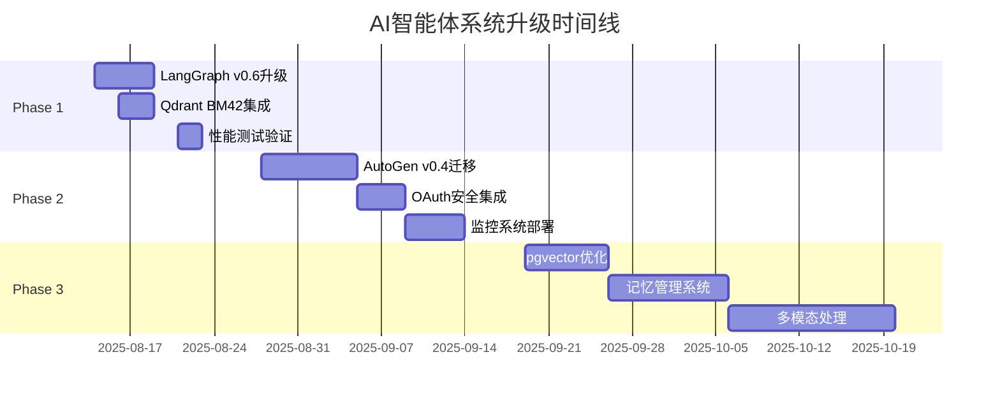

# 🚀 AI智能体系统2025升级项目

基于2024-2025年AI技术栈深度研究，将现有系统升级到最新技术标准的完整规划。

## 📋 快速导航

### 🎯 项目核心文档
- **[📄 完整PRD](./prd/upgrade-2025/AI_Agent_System_Upgrade_PRD.md)** - 产品需求规格说明
- **[🗺️ 实施路线图](./roadmap/Implementation_Roadmap_2025.md)** - 10周详细执行计划
- **[⚡ 快速开始指南](./guides/Quick_Start_Guide.md)** - 30分钟快速启动

### 📦 Phase实施计划
- **[Phase 1: 核心性能提升](./epics/upgrade-2025/Phase1_Core_Performance_Epic.md)** (1-2周)
- **[Phase 2: 架构现代化](./epics/upgrade-2025/Phase2_Architecture_Modernization_Epic.md)** (2-4周)  
- **[Phase 3: 高级特性](./epics/upgrade-2025/Phase3_Advanced_Features_Epic.md)** (1-2个月)

### 📚 文档索引
- **[📋 PRD文档索引](./prd/upgrade-2025/index.md)** - 完整文档结构导航

---

## 🎯 项目价值

### 即时收益
- **📈 性能提升50%+**: 响应时间、并发处理能力显著改善
- **🔧 技术现代化**: 掌握LangGraph v0.6、AutoGen v0.4等最新技术
- **🛡️ 企业级标准**: 安全认证、系统监控、可扩展架构

### 长期价值
- **📚 能力建设**: 完整的现代AI系统开发经验
- **💡 学习收益**: 掌握价值$150K+的前沿技术栈
- **🚀 职业发展**: 建立Senior AI Engineer能力模型

---

## ⚡ 立即开始

### 30分钟快速启动
```bash
# 1. 备份当前系统
git checkout -b backup-before-upgrade-$(date +%Y%m%d)
git commit -am "backup: system state before major upgrade"

# 2. 创建升级分支
git checkout -b feature/phase1-langgraph-v06-upgrade

# 3. 建立性能基线
cd apps/api/src && python -m pytest tests/ --benchmark-only
```

### 第一个里程碑 (1小时)
- ✅ LangGraph v0.6环境升级
- ✅ Context API第一个实现
- ✅ 兼容性测试验证

详细步骤参见：**[快速开始指南](./guides/Quick_Start_Guide.md)**

---

## 📊 技术升级重点

### 当前技术栈 vs 目标技术栈

| 组件 | 当前版本 | 目标版本 | 主要提升 |
|------|----------|----------|----------|
| LangGraph | v0.5.x | **v0.6.x** | Context API + Node Caching |
| AutoGen | v0.2 | **v0.4** | 异步事件驱动架构 |
| Qdrant | 基础向量搜索 | **BM42混合搜索** | 搜索准确率提升20%+ |
| PostgreSQL | pgvector基础 | **pgvector 0.8** | 查询性能提升9倍 |
| 监控 | 基础日志 | **OpenTelemetry** | 企业级可观测性 |
| 安全 | 基础认证 | **OAuth 2.1** | 企业级安全标准 |

### 预期性能改善
- 🚀 **响应时间**: 200ms → 100ms (50%提升)
- 📈 **并发能力**: 500 RPS → 1000 RPS (100%提升)
- 🎯 **搜索准确率**: baseline + 20%提升
- 💾 **存储成本**: 降低30倍 (量化压缩)

---

## 🕐 项目时间线



**总工期**: 10周 (2025-08-14 至 2025-11-07)

---

## 📋 文档使用指南

### 角色导航

**🏢 项目决策者**
1. 阅读 [完整PRD](./prd/upgrade-2025/AI_Agent_System_Upgrade_PRD.md) 了解整体价值和投资回报
2. 查看 [实施路线图](./roadmap/Implementation_Roadmap_2025.md) 了解时间线和资源需求
3. 参考成功指标评估项目风险和收益

**👨‍💻 技术实施者**  
1. 从 [快速开始指南](./guides/Quick_Start_Guide.md) 开始第一步实施
2. 按照各Phase Epic文档进行详细开发
3. 使用路线图跟踪进度和质量检查点

**📚 学习者**
1. 先了解 [项目背景和技术分析](./prd/upgrade-2025/AI_Agent_System_Upgrade_PRD.md#2-问题陈述与市场分析)
2. 逐个Phase学习最新技术栈的实践应用
3. 参考实施过程建立自己的AI技术能力

---

## 🎖️ 项目成功标准

### Phase完成标准
- ✅ **Phase 1**: 性能提升30%+，RAG准确率提升20%+
- ✅ **Phase 2**: 异步架构稳定，企业级安全和监控
- ✅ **Phase 3**: 数据库性能9倍提升，多模态处理能力

### 整体项目价值
- 🎯 **技术掌握**: 2024-2025年最前沿AI技术栈
- 🎯 **系统性能**: 整体性能提升50%+  
- 🎯 **生产就绪**: 达到enterprise-ready标准
- 🎯 **学习收益**: 建立完整的现代AI开发能力模型

---

## 🔗 相关资源

### 学习资源
- 📖 [LangGraph官方文档](https://langchain-ai.github.io/langgraph/)
- 📖 [AutoGen v0.4指南](https://microsoft.github.io/autogen/)
- 📖 [OpenTelemetry Python](https://opentelemetry.io/docs/python/)

### 项目跟踪
- 📊 进度跟踪: GitHub Project Board
- 📈 性能监控: Grafana仪表板  
- 📝 技术决策: ADR文档记录

---

**项目创建**: 2025-08-13  
**文档维护**: John (Product Manager)  
**下次评审**: 2025-08-16 (Phase 1启动会)