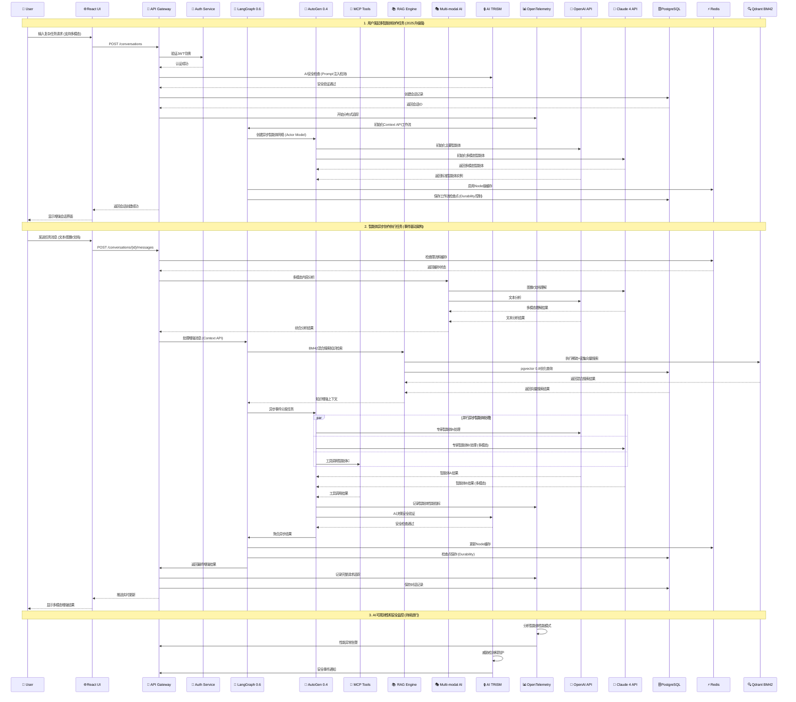

# Core Workflows

以下是系统核心工作流的序列图，展示关键用户旅程中的组件交互，包括2025年架构升级的新特性：

## 2025年架构升级的关键工作流改进:

### 1. **Context API工作流** (LangGraph 0.6.5)
- 类型安全的上下文传递，替代传统config模式
- Durability控制实现细粒度状态管理
- Node缓存优化开发迭代和运行时性能

### 2. **异步事件驱动架构** (AutoGen 0.4.2b1)
- Actor Model实现真正的异步智能体通信
- 事件驱动系统支持复杂协作模式
- 并行智能体处理，显著提升处理能力

### 3. **BM42混合搜索工作流** (Qdrant + pgvector 0.8)
- 稀疏+密集向量的混合检索策略
- FastEmbed推理引擎优化向量生成
- pgvector 0.8的迭代索引扫描优化

### 4. **多模态AI集成工作流**
- Claude 4和GPT-4o的多模态能力整合
- 文本、图像、文档的统一处理pipeline
- 多模态RAG增强的智能检索

### 5. **AI安全和监控工作流**
- AI TRiSM安全框架的实时威胁检测
- OpenTelemetry的完整分布式追踪
- 智能体行为分析和性能优化
