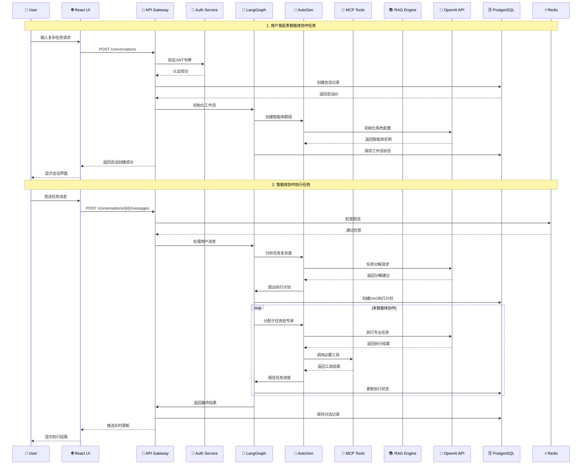

# Core Workflows

以下是系统核心工作流的序列图，展示关键用户旅程中的组件交互，包括外部API集成和错误处理路径：

```mermaid
sequenceDiagram
    participant User as 👤 User
    participant UI as 🌐 React UI
    participant Gateway as 🚀 API Gateway
    participant Auth as 🔐 Auth Service
    participant LG as 🧠 LangGraph
    participant AG as 👥 AutoGen
    participant MCP as 🔧 MCP Tools
    participant RAG as 📚 RAG Engine
    participant OpenAI as 🤖 OpenAI API
    participant DB as 🗄️ PostgreSQL
    participant Redis as ⚡ Redis

    Note over User, Redis: 1. 用户发起多智能体协作任务

    User->>UI: 输入复杂任务请求
    UI->>Gateway: POST /conversations
    Gateway->>Auth: 验证JWT令牌
    Auth-->>Gateway: 认证成功
    
    Gateway->>DB: 创建会话记录
    DB-->>Gateway: 返回会话ID
    
    Gateway->>LG: 初始化工作流
    LG->>AG: 创建智能体群组
    AG->>OpenAI: 初始化角色配置
    OpenAI-->>AG: 返回智能体实例
    
    LG->>DB: 保存工作流状态
    Gateway-->>UI: 返回会话创建成功
    UI-->>User: 显示会话界面

    Note over User, Redis: 2. 智能体协作执行任务

    User->>UI: 发送任务消息
    UI->>Gateway: POST /conversations/{id}/messages
    Gateway->>Redis: 检查限流
    Redis-->>Gateway: 通过检查
    
    Gateway->>LG: 处理用户消息
    LG->>AG: 分析任务复杂度
    AG->>OpenAI: 任务分解请求
    OpenAI-->>AG: 返回分解建议
    
    AG->>LG: 提出执行计划
    LG->>DB: 创建DAG执行计划
    
    loop 多智能体协作
        LG->>AG: 分配子任务给专家
        AG->>OpenAI: 执行专业任务
        OpenAI-->>AG: 返回执行结果
        AG->>MCP: 调用必要工具
        MCP-->>AG: 返回工具结果
        AG->>LG: 报告任务进度
        LG->>DB: 更新执行状态
    end
    
    LG->>Gateway: 返回最终结果
    Gateway->>DB: 保存对话记录
    Gateway-->>UI: 推送实时更新
    UI-->>User: 显示执行结果
```
