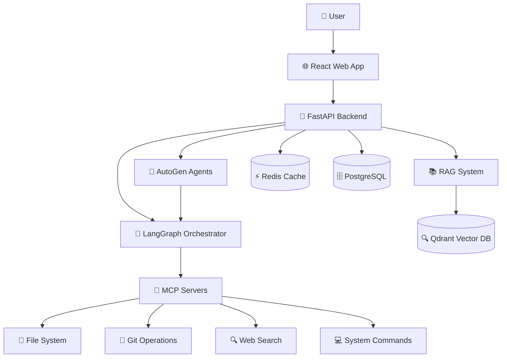

# High Level Architecture

## Technical Summary

本系统adopts微服务启发的模块化单体架构，部署在Docker容器化环境中。前端使用React + TypeScript构建现代化SPA应用，后端基于FastAPI提供高性能异步API服务。核心集成点包括LangGraph工作流编排器作为多智能体协调中心，AutoGen提供群组对话能力，以及MCP协议实现标准化工具生态系统。基础设施采用PostgreSQL作为主数据库，Redis提供缓存和会话管理，Qdrant向量数据库支持RAG语义检索。该架构实现了PRD中定义的AI-First开发模式学习目标，同时保持了生产级的可扩展性和可维护性。

## Platform and Infrastructure Choice

**Platform:** Docker + 自托管（初期），AWS（扩展期）
**Key Services:** PostgreSQL, Redis, Qdrant, FastAPI, React, LangGraph, AutoGen
**Deployment Host and Regions:** 本地开发环境，后期考虑AWS us-east-1

## Repository Structure

**Structure:** Monorepo
**Monorepo Tool:** npm workspaces（轻量级，学习友好）
**Package Organization:** apps/（应用）+ packages/（共享代码）+ tools/（工具脚本）

## High Level Architecture Diagram

## Architectural Patterns

- **Event-Driven Architecture:** 智能体间通过事件总线进行异步通信 - _Rationale:_ 支持复杂的多智能体协作和状态管理
- **Repository Pattern:** 抽象数据访问逻辑，支持测试和数据库切换 - _Rationale:_ 提高代码可测试性和灵活性
- **Plugin Architecture:** MCP协议提供可扩展的工具生态系统 - _Rationale:_ 实现标准化工具集成，支持第三方扩展
- **Hexagonal Architecture:** 将业务逻辑与外部依赖解耦 - _Rationale:_ 提高系统的可测试性和适应性
- **CQRS Pattern:** 分离命令和查询操作，优化性能 - _Rationale:_ 支持复杂的AI推理和数据检索场景
- **Saga Pattern:** 管理跨智能体的长运行事务 - _Rationale:_ 确保多步骤AI任务的一致性和可恢复性
