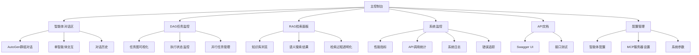
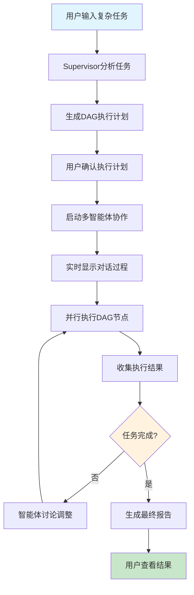
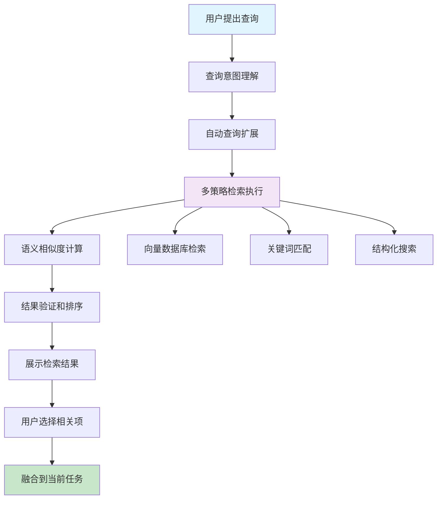
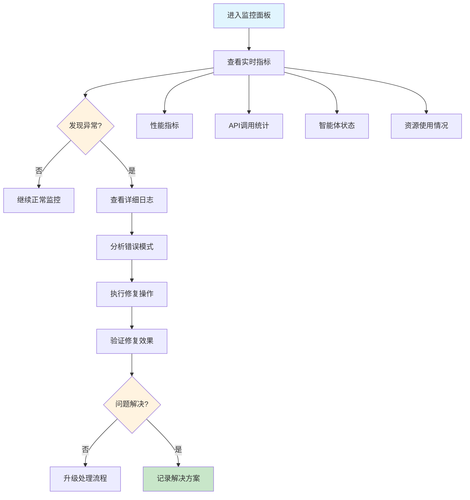

# Personal AI Agent System UI/UX Specification

## 📋 Introduction

This document defines the user experience goals, information architecture, user flows, and visual design specifications for Personal AI Agent System's user interface. It serves as the foundation for visual design and frontend development, ensuring a cohesive and user-centered experience.

### Overall UX Goals & Principles

Based on your PRD, I'm drafting the foundational UX approach for your developer-focused AI agent platform:

#### Target User Personas

**Primary User: AI Learning Developer (You)**
- Technical professional with strong programming background
- Goal: Master modern AI development technologies through hands-on practice
- Needs: Clear visibility into complex AI processes, debugging capabilities, learning-oriented interfaces
- Context: Working alone on a learning project, values function over form

**Secondary User: Technical Evaluator**
- Hiring managers, technical interviewers, fellow developers
- Goal: Understand and evaluate your AI development capabilities
- Needs: Clear demonstration of technical competency, well-organized project showcase
- Context: Limited time to assess project, focus on technical sophistication

#### Usability Goals

**Learning-Focused Usability:**
- **Process Transparency**: Every AI decision and tool interaction should be visible and traceable
- **Technical Depth**: Interface should expose the complexity of multi-agent systems for learning purposes  
- **Debugging Support**: Easy access to logs, state information, and execution details
- **Demo Readiness**: Key workflows should be easily demonstrable for technical interviews

#### Design Principles

1. **Transparency Over Simplification** - Show the complexity of AI systems rather than hiding it
2. **Information Density** - Pack meaningful technical information into interfaces efficiently
3. **Developer Ergonomics** - Use familiar patterns from development tools (VS Code, terminals, dashboards)  
4. **Real-time Observability** - Provide live updates on system state and AI agent activities
5. **Technical Credibility** - Design should demonstrate deep understanding of AI architectures

### Change Log
| Date | Version | Description | Author |
|------|---------|-------------|---------|
| 2025-01-01 | 1.0 | Initial UI/UX specification creation | UX Expert (Sally) |

## 🏗️ Information Architecture (IA)

Based on your PRD, I designed the following information architecture for Personal AI Agent System:

### Site Map / Screen Inventory



### Navigation Structure

**Primary Navigation:** 顶部水平导航栏，包含五个主要功能区域（控制台、对话、任务、检索、监控），外加API文档和设置入口。采用类似VS Code的标签页设计，支持多视图同时打开。

**Secondary Navigation:** 每个主要区域内的左侧垂直导航或子标签，提供该区域内的具体功能模块访问。例如对话区的群组对话、单智能体、历史记录等。

**Breadcrumb Strategy:** 技术导向的路径显示，格式为 "功能区 > 子模块 > 具体任务"，例如 "DAG监控 > 任务执行 > task_id_123"。重点展示技术层次而非用户友好性。

## 🔄 User Flows

Based on the core functionalities in your PRD, I designed key user flows for Personal AI Agent System:

### Flow 1: Multi-Agent Collaborative Task Execution

**User Goal:** 通过多个专业智能体协作解决复杂的开发任务

**Entry Points:** 主控制台任务输入框，智能体对话区

**Success Criteria:** 任务成功分解并执行，用户能观察到完整的协作过程和结果

#### Flow Diagram



#### Edge Cases & Error Handling:
- 任务描述模糊或不完整时的澄清流程
- 智能体协作出现分歧时的仲裁机制
- DAG执行中单个节点失败的重试和恢复
- API调用超限或服务不可用的优雅降级
- 长时间任务的暂停和恢复功能

**Notes:** 此流程是系统的核心展示功能，需要特别关注可视化效果和技术细节的透明度

### Flow 2: RAG Enhanced Knowledge Retrieval

**User Goal:** 通过智能检索获取相关代码和文档信息来辅助开发任务

**Entry Points:** RAG检索面板，任务执行过程中的自动触发

**Success Criteria:** 检索到相关且准确的信息，检索过程透明可追溯

#### Flow Diagram



#### Edge Cases & Error Handling:
- 查询无相关结果时的建议和引导
- 向量数据库连接失败的fallback策略
- 检索结果质量评估和置信度显示
- 知识库内容过时或不准确的标记机制

### Flow 3: System Status Monitoring and Debugging

**User Goal:** 实时了解系统运行状态，快速定位和解决问题

**Entry Points:** 系统监控面板，任务执行过程中的状态查看

**Success Criteria:** 清晰了解系统健康状况，能够快速识别和解决问题

#### Flow Diagram



#### Edge Cases & Error Handling:
- 监控数据采集失败的替代方案
- 大量错误日志的智能筛选和聚合
- 系统过载时的优先级管理
- 历史数据的查询和对比分析

## 🎨 Wireframes & Key Screen Layouts

Based on your technical learning goals and developer user needs, I planned key interface layouts for Personal AI Agent System:

### Design Files

**Primary Design Files:** 建议使用Figma进行详细的界面设计，便于后续的前端开发和迭代。由于这是学习项目，可以先创建低保真线框图，然后逐步完善为高保真设计稿。

### Key Screen Layouts

#### Main Console Interface

**Purpose:** 系统的核心操作中心，整合所有主要功能模块

**Key Elements:**
- 顶部导航栏：功能模块切换（对话/任务/检索/监控/API/设置）
- 左侧任务输入区：自然语言任务描述输入框和快速操作按钮
- 中央主要工作区：根据选中模块显示相应内容（多标签页支持）
- 右侧状态面板：系统健康状态、当前活动智能体、资源使用情况
- 底部状态栏：当前操作状态、API调用统计、时间戳信息

**Interaction Notes:** 采用类似VS Code的布局，支持面板的显示/隐藏、大小调整。主工作区支持多标签同时打开，便于并行监控多个任务。

**Design File Reference:** `/figma/main-console-layout`

#### Multi-Agent Conversation View

**Purpose:** 实时展示AutoGen智能体间的协作讨论过程

**Key Elements:**
- 对话时间线：按时间顺序显示智能体发言，不同智能体用不同颜色标识
- 智能体状态指示器：显示当前活跃的智能体和其角色信息
- 发言内容格式化：支持代码高亮、Markdown渲染、图表嵌入
- 协作决策记录：重要决策点的标记和投票结果显示
- 对话控制面板：暂停/继续、插入人工反馈、导出对话记录

**Interaction Notes:** 支持实时滚动更新，智能体发言时有动画提示。点击智能体名称可查看其详细信息和历史发言。支持搜索和过滤特定智能体的发言。

**Design File Reference:** `/figma/multi-agent-conversation`

#### DAG Task Visualization Interface

**Purpose:** 图形化展示任务依赖关系和执行状态

**Key Elements:**
- 任务依赖图：使用节点和连线显示任务关系，支持自动布局
- 节点状态指示：不同颜色表示待执行/执行中/已完成/失败状态
- 执行进度追踪：实时更新节点状态，显示执行时间和进度
- 任务详情面板：选中节点时显示详细信息、日志、错误信息
- 控制操作区：重试失败任务、暂停执行、手动触发特定节点

**Interaction Notes:** 支持拖拽移动节点位置，缩放查看大型任务图。鼠标悬停显示任务摘要，点击展开详细信息。支持按执行状态筛选显示节点。

**Design File Reference:** `/figma/dag-visualization`

#### RAG Retrieval Results Interface

**Purpose:** 透明化展示知识检索和增强生成过程

**Key Elements:**
- 查询分析展示：显示原始查询、扩展查询、意图理解结果
- 检索策略面板：展示语义搜索、关键词匹配、结构化搜索的并行结果
- 结果相关性评分：每个检索结果的置信度和相关性分数
- 知识片段预览：检索到的代码片段、文档段落的格式化展示
- 答案合成过程：显示如何将多个知识片段融合为最终答案

**Interaction Notes:** 支持展开/折叠不同检索策略的结果，点击知识片段可查看完整上下文。提供反馈机制，用户可标记结果的有用性。

**Design File Reference:** `/figma/rag-retrieval-interface`

#### System Monitoring Dashboard

**Purpose:** 实时展示系统性能和健康状态

**Key Elements:**
- 关键指标卡片：API响应时间、并发请求数、智能体活跃度、错误率
- 实时图表：时间序列图表显示性能趋势和历史数据
- 日志流面板：滚动显示最新的系统日志，支持级别过滤
- 告警通知区：系统异常和重要事件的提醒
- 资源使用状况：CPU、内存、数据库连接池、API配额使用情况

**Interaction Notes:** 图表支持时间范围选择和数据钻取。日志支持关键词搜索和正则表达式过滤。告警可标记为已读或忽略。

**Design File Reference:** `/figma/monitoring-dashboard`

## 🧩 Component Library / Design System

Based on your technical learning project characteristics, I designed a lightweight but professional component library for Personal AI Agent System:

### Design System Approach

**Design System Approach:** 创建定制化的轻量级设计系统，重点关注开发工具风格的组件。不采用现有的通用UI库（如Material-UI、Ant Design），而是构建符合技术展示需求的专业化组件集合。这样既能展示前端设计能力，又能精确满足AI开发工具的独特需求。

### Core Components

#### AgentStatusCard 智能体状态卡片

**Purpose:** 显示单个智能体的当前状态、角色信息和活动情况

**Variants:** 
- Compact（紧凑型）：仅显示名称、状态和简要信息
- Detailed（详细型）：包含角色描述、当前任务、历史统计
- Interactive（交互型）：支持点击展开、配置修改

**States:** Active（活跃）、Idle（空闲）、Busy（忙碌）、Error（错误）、Offline（离线）

**Usage Guidelines:** 用于多智能体系统的状态监控，支持实时状态更新和颜色编码。在主控制台和对话界面中广泛使用。

#### TaskNode DAG任务节点

**Purpose:** DAG可视化中的任务节点，展示任务状态和执行信息

**Variants:**
- Standard（标准型）：基础任务节点，显示名称和状态
- WithProgress（带进度）：包含进度条和时间估算
- Composite（复合型）：包含子任务的复杂节点

**States:** Pending（待执行）、Running（执行中）、Completed（已完成）、Failed（失败）、Skipped（跳过）

**Usage Guidelines:** 节点大小根据任务复杂度自适应，支持拖拽和连线操作。颜色和图标清晰标识不同状态。

#### ConversationMessage 对话消息

**Purpose:** 多智能体对话中的消息展示组件

**Variants:**
- UserMessage（用户消息）：人类用户的输入消息
- AgentMessage（智能体消息）：AI智能体的回复消息
- SystemMessage（系统消息）：系统通知和状态更新
- CodeBlock（代码块）：包含代码的特殊消息格式

**States:** Sending（发送中）、Delivered（已送达）、Processing（处理中）、Completed（完成）

**Usage Guidelines:** 支持Markdown渲染、代码高亮、时间戳显示。不同智能体使用不同的颜色主题标识。

#### MetricsDashboard 指标仪表板

**Purpose:** 系统监控数据的可视化展示组件

**Variants:**
- SingleMetric（单指标）：显示一个关键指标和趋势
- MultiMetric（多指标）：网格布局显示多个相关指标
- TimeSeriesChart（时序图表）：历史数据的线图或柱图展示

**States:** Loading（加载中）、Updated（已更新）、Error（错误）、NoData（无数据）

**Usage Guidelines:** 支持实时数据更新、阈值告警、时间范围选择。图表使用专业的数据可视化库（如Chart.js或D3.js）。

#### SearchResultItem 搜索结果项

**Purpose:** RAG检索结果的展示组件

**Variants:**
- CodeSnippet（代码片段）：显示检索到的代码片段
- DocumentChunk（文档块）：显示文档段落和摘要
- StructuredData（结构化数据）：显示API响应、配置信息等

**States:** Relevant（相关）、Highlighted（高亮）、Selected（已选择）、Bookmarked（已收藏）

**Usage Guidelines:** 支持相关性评分显示、语法高亮、快速预览。提供反馈机制供用户标记结果质量。

#### CommandInput 命令输入

**Purpose:** 自然语言任务输入和系统命令执行

**Variants:**
- SimpleInput（简单输入）：基础的文本输入框
- SmartInput（智能输入）：带自动补全和建议的输入
- CodeInput（代码输入）：支持代码语法的输入框

**States:** Empty（空白）、Typing（输入中）、Validating（验证中）、Ready（就绪）、Error（错误）

**Usage Guidelines:** 支持历史记录、快捷命令、语法验证。提供输入提示和错误反馈。

## 🎨 Branding & Style Guide

Based on your technical learning project positioning, I designed a professional technical style guide for Personal AI Agent System:

### Visual Identity

**Brand Guidelines:** 没有现有的企业品牌限制，完全围绕"技术专业性"和"AI智能化"主题设计。整体风格借鉴现代开发工具（VS Code、GitHub、Terminal）的设计语言，体现技术深度和专业素养。

### Color Palette

| Color Type | Hex Code | Usage |
|------------|----------|--------|
| Primary | #0066CC | 主要按钮、链接、强调元素 |
| Secondary | #6C757D | 次要文本、边框、辅助元素 |
| Accent | #28A745 | 成功状态、完成标识、正面反馈 |
| Success | #28A745 | 任务完成、系统正常、验证通过 |
| Warning | #FFC107 | 注意事项、待处理状态、性能告警 |
| Error | #DC3545 | 错误信息、失败状态、危险操作 |
| Neutral | #343A40, #6C757D, #ADB5BD, #F8F9FA | 文本层次、边框、背景、分隔线 |

**Special AI Theme Colors:**
- **Agent Blue:** #4A90E2 - 智能体相关元素
- **RAG Green:** #50C878 - 知识检索相关
- **DAG Orange:** #FF8C00 - 任务流程相关
- **Monitor Purple:** #8A2BE2 - 监控和统计相关

### Typography

#### Font Families

- **Primary:** Inter (现代无衬线字体，清晰易读，技术感强)
- **Secondary:** Roboto (Google字体，良好的屏幕显示效果)
- **Monospace:** Fira Code (支持连字的编程字体，代码展示专用)

#### Type Scale

| Element | Size | Weight | Line Height |
|---------|------|--------|-------------|
| H1 | 32px | 700 | 1.2 |
| H2 | 24px | 600 | 1.3 |
| H3 | 20px | 600 | 1.4 |
| Body | 16px | 400 | 1.5 |
| Small | 14px | 400 | 1.4 |
| Code | 14px | 400 | 1.3 |
| Caption | 12px | 400 | 1.3 |

### Iconography

**Icon Library:** Lucide React (现代、一致的开源图标库，技术风格明显)

**Usage Guidelines:** 
- 标准图标尺寸：16px、20px、24px、32px
- 智能体相关：使用机器人、对话气泡、网络节点图标
- 任务流程：使用流程图、箭头、状态指示器图标
- 系统状态：使用仪表板、图表、警告图标
- 保持图标风格一致，优选线性图标风格

### Spacing & Layout

**Grid System:** 基于8px基础单位的网格系统
- 基础间距单位：8px
- 常用间距：8px、16px、24px、32px、48px、64px
- 组件内边距：16px
- 组件间距：24px
- 页面边距：32px

**Spacing Scale:**
```css
--spacing-xs: 4px;   /* 最小间距 */
--spacing-sm: 8px;   /* 小间距 */
--spacing-md: 16px;  /* 中等间距 */
--spacing-lg: 24px;  /* 大间距 */
--spacing-xl: 32px;  /* 超大间距 */
--spacing-xxl: 48px; /* 页面级间距 */
```

## ♿ Accessibility Requirements

Based on your personal learning project characteristics, I established practical accessibility standards for Personal AI Agent System:

### Compliance Target

**Standard:** WCAG 2.1 AA级别（部分实施）
- 作为学习项目，不强制要求完全合规，但遵循核心可访问性原则
- 重点关注技术展示效果和基础可用性
- 优先实施对技术演示有益的无障碍特性

### Key Requirements

**Visual:**
- Color contrast ratios: 文本与背景对比度至少4.5:1，大文本至少3:1
- Focus indicators: 所有可交互元素有清晰的键盘焦点样式，使用2px蓝色边框
- Text sizing: 支持浏览器缩放至200%而不影响功能，基础字号不小于16px

**Interaction:**
- Keyboard navigation: 所有功能都可通过键盘访问，Tab键顺序符合逻辑
- Screen reader support: 重要元素有适当的ARIA标签和语义化HTML
- Touch targets: 可点击元素最小尺寸44x44px，间距至少8px

**Content:**
- Alternative text: 图标和图表提供描述性alt文本或aria-label
- Heading structure: 使用语义化的h1-h6标题，不跳级使用
- Form labels: 所有输入字段有明确的label或aria-labelledby

**Special AI Interface Considerations:**
- **Multi-agent conversations:** 使用role属性区分不同智能体的发言
- **DAG visualization:** 提供表格形式的任务列表作为图形的替代表示
- **Real-time updates:** 使用aria-live区域通知屏幕阅读器重要状态变化
- **Complex data:** 监控图表提供数据表格和文字描述

### Testing Strategy

**基础测试方法：**
1. **键盘导航测试：** 仅使用键盘完成所有核心操作流程
2. **色彩对比检查：** 使用浏览器开发工具验证对比度
3. **屏幕阅读器测试：** 使用NVDA或系统内置阅读器测试主要功能
4. **缩放测试：** 验证200%缩放下的界面可用性

## 📱 Responsiveness Strategy

Based on your PRD's clear positioning of "desktop-first, no mobile support", I established a targeted responsive strategy for Personal AI Agent System:

### Breakpoints

| Breakpoint | Min Width | Max Width | Target Devices |
|------------|-----------|-----------|----------------|
| Mobile | - | 768px | 不支持（仅基础降级处理） |
| Tablet | 768px | 1024px | iPad等大尺寸平板（有限支持） |
| Desktop | 1024px | 1440px | 主要目标：笔记本电脑和桌面显示器 |
| Wide | 1440px | - | 大屏显示器、多显示器设置 |

### Adaptation Patterns

**Layout Changes:** 
- **Desktop（1024px+）：** 完整的多面板布局，所有功能同屏显示
- **Tablet（768-1024px）：** 简化的双面板布局，部分功能隐藏到菜单中
- **Mobile（<768px）：** 显示"不支持移动设备"提示，建议使用桌面浏览器

**Navigation Changes:**
- **Desktop：** 顶部水平导航 + 左侧垂直导航的完整导航体系
- **Tablet：** 顶部水平导航 + 折叠式侧边导航
- **Mobile：** 显示基础信息和桌面版本引导

**Content Priority:**
- **高优先级：** 智能体对话、DAG执行状态、核心监控指标
- **中优先级：** RAG检索结果、详细日志、配置面板
- **低优先级：** 辅助信息、历史数据、高级设置

**Interaction Changes:**
- **Desktop：** 鼠标悬停效果、右键菜单、拖拽操作、多选操作
- **Tablet：** 触摸友好的按钮尺寸、滑动操作、长按菜单
- **Mobile：** 基础的信息展示，不支持复杂交互

## ✨ Animation & Micro-interactions

Based on your technical professional project positioning, I designed both practical and technically sophisticated animation effects for Personal AI Agent System:

### Motion Principles

**Animation Design Principles:**
- **功能导向：** 动画服务于信息传递和状态反馈，不做纯装饰性动效
- **性能优先：** 优先使用CSS transform和opacity，避免引起重排重绘
- **技术感突出：** 采用机械感、数据流动感的动效风格，体现AI系统特色  
- **可控性强：** 用户可以禁用动画，满足无障碍性需求和性能偏好
- **一致性保证：** 相似功能使用相同的动效模式，建立用户认知

### Key Animations

**智能体状态变化 - AgentStatusPulse**
- **描述：** 智能体从空闲变为活跃时的呼吸灯效果，模拟AI"思考"状态
- **持续时间：** 1.2s循环
- **缓动函数：** ease-in-out
- **技术实现：** CSS transform: scale() + opacity变化

**任务节点状态转换 - NodeStateTransition**  
- **描述：** DAG任务节点状态改变时的颜色渐变和图标切换
- **持续时间：** 300ms
- **缓动函数：** cubic-bezier(0.4, 0.0, 0.2, 1)
- **技术实现：** CSS color transition + SVG图标morphing

**对话消息流入 - MessageStreamIn**
- **描述：** 新消息出现时的从右滑入效果，模拟消息传递过程
- **持续时间：** 250ms
- **缓动函数：** ease-out
- **技术实现：** CSS transform: translateX() + opacity

**数据加载流 - DataStreamFlow**
- **描述：** RAG检索和数据加载时的数据流动动画
- **持续时间：** 1.5s循环
- **缓动函数：** linear
- **技术实现：** CSS animation + gradient移动

**图表数据更新 - ChartDataUpdate**
- **描述：** 监控图表数据更新时的平滑过渡动画
- **持续时间：** 500ms
- **缓动函数：** ease-in-out
- **技术实现：** Chart.js内置动画 + 自定义缓动

**界面焦点引导 - FocusHighlight**
- **描述：** 重要操作或状态变化时的注意力引导动画
- **持续时间：** 800ms（仅播放一次）
- **缓动函数：** ease-out
- **技术实现：** CSS box-shadow脉冲 + border高亮

**面板展开折叠 - PanelSlide**
- **描述：** 侧边面板和详情面板的展开收起动画
- **持续时间：** 200ms
- **缓动函数：** ease-in-out
- **技术实现：** CSS height/width transition + overflow处理

**系统状态指示 - SystemPulse**
- **描述：** 系统健康状态的律动效果，异常时加快频率
- **持续时间：** 2s循环（正常），1s循环（异常）
- **缓动函数：** ease-in-out
- **技术实现：** CSS animation + 动态duration控制

## ⚡ Performance Considerations

Based on the technical characteristics of your AI agent system, I established the following performance goals and optimization strategies:

### Performance Goals

- **页面加载：** 初始页面加载时间 < 3秒，后续页面切换 < 1秒
- **交互响应：** 用户操作响应时间 < 200ms，复杂计算操作 < 2秒
- **动画帧率：** 所有动画保持 60fps，确保流畅的用户体验

### Design Strategies

**针对AI系统特有的性能挑战：**

**实时数据更新优化：**
- 使用WebSocket连接减少HTTP轮询开销
- 实施智能数据diff，只更新变化的DOM元素
- 多智能体对话采用虚拟滚动，处理大量消息历史
- 监控图表使用数据采样，避免渲染过多数据点

**复杂可视化性能：**
- DAG图形使用Canvas渲染大型任务图，DOM渲染小型图
- 图表库选择Chart.js轻量级方案，避免过重的D3.js
- 大数据表格使用表格虚拟化技术
- 图片和图标使用WebP格式，SVG图标优先

**代码分割和懒加载：**
- 按功能模块分割JavaScript包（对话模块、DAG模块、监控模块）
- AI模型相关的大型库按需加载
- 非关键功能（如高级设置）采用懒加载
- 路由级别的代码分割，减少初始包大小

**内存管理：**
- 长时间运行的页面定期清理无用的对话历史
- 图表数据采用滑动窗口，限制内存中的数据量
- 组件卸载时清理定时器和事件监听器
- 使用React.memo和useMemo优化重渲染

**网络请求优化：**
- API响应启用gzip压缩
- 静态资源使用CDN分发
- 实施请求去重，避免重复的API调用
- 关键数据使用预加载和缓存策略

## 🚀 Next Steps

### Immediate Actions

1. **与项目相关方审核规格**
   - 确认UX设计方向符合技术学习目标
   - 验证界面复杂度适合12周开发周期
   - 评估设计规格的技术可行性

2. **创建或更新设计文件**
   - 在Figma中创建详细的界面设计稿
   - 制作核心界面的交互原型
   - 完善组件库设计和规范文档

3. **准备开发移交**
   - 整理完整的设计资产和切图
   - 编写详细的前端开发指南
   - 准备设计系统的代码实现方案

### Design Handoff Checklist

- [x] All user flows documented
- [x] Component inventory complete
- [x] Accessibility requirements defined
- [x] Responsive strategy clear
- [x] Brand guidelines incorporated
- [x] Performance goals established