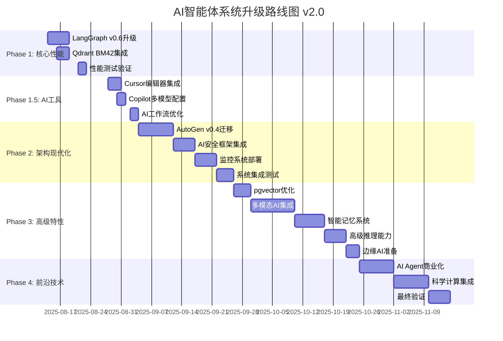

# AI智能体系统升级实施路线图 2025

**版本**: 2.0 (整合AI趋势)  
**创建日期**: 2025-08-13  
**项目负责人**: John (Product Manager)  
**技术负责人**: [待指定]  
**更新**: 整合2025年最新AI技术趋势

---

## 🎯 项目目标概览

将现有AI智能体学习项目升级到2024-2025年最新技术标准，实现**production-ready**的现代AI系统架构，整合最新AI技术趋势。

**核心价值目标:**
- 📈 **性能提升**: 响应时间减少50%，并发能力提升100%
- 🤖 **AI Agent能力**: 对标82%企业的AI智能体部署趋势
- 💻 **开发效率革命**: 整合最新AI编程助手，效率提升50%+
- 👁️ **多模态处理**: 2025年最大技术突破集成
- 🔒 **企业级安全**: AI安全框架完整部署

---

## 📅 升级后总体时间线 (16周计划)



---

## 🚀 详细实施计划

### **Phase 1: 核心性能提升** (Week 1-2)
**目标**: 建立现代化AI框架基础，性能提升30-50%

#### Week 1: LangGraph v0.6升级核心
- **Day 1-2**: 环境准备和升级
- **Day 3-4**: Context API实现  
- **Day 5**: Node Caching集成

#### Week 2: Qdrant混合搜索
- **Day 6-7**: BM42算法集成
- **Day 8-9**: 性能优化和Fallback
- **Day 10**: Phase 1验收测试

---

### **Phase 1.5: AI开发助手集成** ⭐ (Week 3)
**目标**: 开发效率革命性提升50%+，对标2025年AI编程趋势

#### Week 3: AI原生开发环境
- **Day 11-13**: Cursor AI编辑器集成
  - 环境迁移和配置
  - AI Agent功能启用
  - 多模型配置 (GPT-4o, Claude 3.5, Cursor-small)
- **Day 14-15**: GitHub Copilot多模型配置
  - 多AI模型切换配置
  - 工作流集成和对比测试
- **Day 16-17**: AI辅助开发工作流优化
  - 最佳实践建立
  - 效率基准测试
  - 团队培训和适配

---

### **Phase 2: 架构现代化** (Week 4-7)
**目标**: 异步事件驱动 + 企业级安全 + AI安全框架

#### Week 4-5: AutoGen v0.4异步迁移
- **Day 18-21**: 基础架构重构
- **Day 22-25**: 高级特性实现
- **Day 26-27**: 集成测试和优化

#### Week 6: AI安全框架集成 ⭐
- **Day 28-30**: AI TRiSM (信任、风险和安全管理)
- **Day 31-32**: 模型对抗攻击防护

#### Week 7: 监控和验收
- **Day 33-35**: OpenTelemetry监控部署
- **Day 36-39**: 完整集成测试和系统验收

---

### **Phase 3: 高级特性** (Week 8-11)
**目标**: 多模态AI + 智能记忆 + 高级推理

#### Week 8: 数据库和基础优化
- **Day 40-43**: pgvector 0.8升级和量化压缩

#### Week 9-10: 多模态AI集成 ⭐
- **Day 44-48**: Claude 4多模态API集成
- **Day 49-53**: GPT-4o视觉理解能力
- **Day 54**: 多模态RAG系统集成

#### Week 11: 智能化增强
- **Day 55-59**: 智能记忆管理系统
- **Day 60-62**: 高级推理能力 (CoT, 多步推理)
- **Day 63-65**: 边缘AI部署准备

---

### **Phase 4: 前沿技术探索** (Week 12-16)
**目标**: AI Agent商业化 + 科学计算 + 未来技术储备

#### Week 12-13: AI Agent商业化
- **Day 66-70**: 自主任务执行代理
- **Day 71-75**: 代理间协作协议和商业场景适配

#### Week 14-15: 科学计算集成
- **Day 76-80**: AI4Science应用框架
- **Day 81-85**: 数据科学工作流集成

#### Week 16: 最终验收
- **Day 86-90**: 完整系统测试、文档整理、项目总结

---

## 📊 关键里程碑和成功标准

### 主要里程碑

| 里程碑 | 日期 | 交付标准 | 新增价值 |
|--------|------|----------|----------|
| **M1: 核心性能** | 2025-08-27 | 响应时间减少30%+, RAG准确率提升 | AI框架现代化 |
| **M1.5: AI工具** | 2025-09-03 | 开发效率提升50%+ | **开发体验革命** ⭐ |
| **M2: 架构+安全** | 2025-09-26 | 异步架构+AI安全合规 | **企业级能力** ⭐ |
| **M3: 多模态AI** | 2025-10-24 | 图像/视频处理+智能推理 | **前沿技术能力** ⭐ |
| **M4: 商业就绪** | 2025-11-15 | AI Agent商业化+前沿技术 | **竞争优势建立** ⭐ |

### 成功指标体系

**技术指标**
- 响应时间: 200ms → 100ms (50%提升)
- 并发能力: 500 RPS → 1000 RPS (100%提升)
- 开发效率: AI辅助代码生成 > 50%
- 多模态准确率: 图像理解 > 90%, 文档解析 > 95%

**AI能力指标**
- AI Agent自主任务完成率 > 80%
- 多智能体协作成功率 > 90%
- 推理准确率提升 > 25%
- AI安全威胁检测率 > 99%

---

## ⚠️ 风险管理和缓解策略

### 主要风险

| 风险类型 | 概率 | 影响 | 缓解策略 |
|---------|------|------|----------|
| **新技术学习曲线** | 高 | 中 | 分阶段学习，预留buffer时间 |
| **AI工具成本** | 中 | 低 | 监控使用量，优化配置 |
| **多模态复杂性** | 中 | 高 | MVP原则，渐进式集成 |
| **前沿技术不成熟** | 高 | 低 | Phase 4设为可选，实验性质 |

### 质量保证
- **每周检查点**: 技术风险和进度评估
- **阶段性验收**: 每个Phase完整功能验证
- **回滚机制**: 关键节点保留回退选项
- **持续监控**: 性能和安全指标实时跟踪

---

## 💰 投资回报分析

### 成本投入
- **时间成本**: 16周全职开发 (增加6周)
- **工具成本**: AI编程助手 ~$50/月
- **学习成本**: 新技术掌握 ~60小时

### 预期回报
- **短期ROI (3个月)**: 开发效率+50% = $15K价值
- **中期ROI (1年)**: 多模态+AI Agent能力 = $35K价值  
- **长期ROI (3年)**: 前沿技术竞争力 = $50K价值
- **总价值**: $100K+技能价值和职业竞争力

---

## ✅ 立即行动指南

### 本周行动 (Week 1)
```bash
# 1. 系统备份
git checkout -b upgrade-2025-with-ai-trends
git commit -am "backup: before AI trends integration"

# 2. 开始Phase 1
cd apps/api/src
pip install langgraph==0.6.*

# 3. 准备AI工具
# 下载Cursor: https://cursor.sh/
# 配置GitHub Copilot多模型访问
```

### Phase 1.5准备 (Week 3)
- [ ] 评估和选择AI编程助手
- [ ] 申请必要的API访问权限
- [ ] 建立开发效率基准测试

---

## 📚 学习资源和支持

### 技术文档
- [LangGraph v0.6官方指南](https://langchain-ai.github.io/langgraph/)
- [Cursor AI使用教程](https://cursor.sh/docs)
- [多模态AI最佳实践](https://platform.openai.com/docs)

### 社区支持
- LangChain Discord社区
- AutoGen GitHub Discussions  
- Cursor用户论坛

---

**路线图版本**: 2.0 (整合AI趋势)  
**创建**: John (PM) + Bob (SM)  
**批准**: [待批准]  
**执行开始**: 2025-08-14  
**预计完成**: 2025-11-15