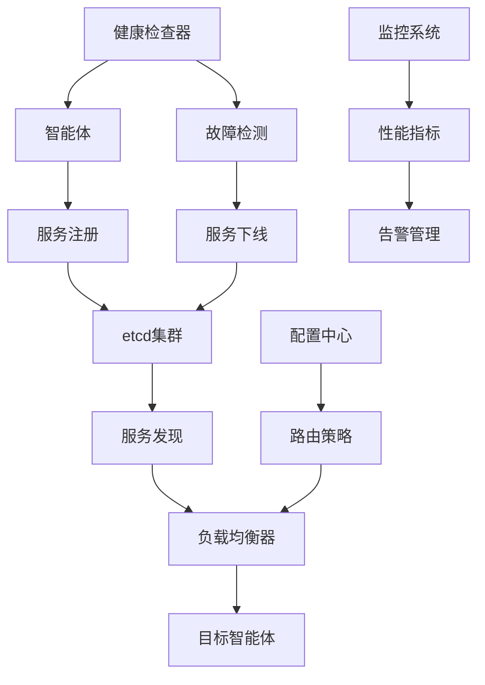

# Story 10.1: 智能体服务发现系统

**Story ID**: STORY-10.1-AGENT-SERVICE-DISCOVERY  
**Epic**: Epic 10 - 分布式智能体网络  
**优先级**: P1  
**预估工期**: 2-3周  
**故事点数**: 13  
**负责团队**: 分布式系统团队

## 📋 用户故事

作为分布式智能体系统的开发者和运维人员，我需要一个可靠的服务发现系统，能够自动管理大量智能体的注册和发现，支持动态扩缩容和故障转移，确保智能体间的通信和协作能够高效、稳定地进行。

### 🎯 用户价值

- **自动发现**: 智能体自动注册和发现，无需手动配置
- **高可用性**: 基于etcd的强一致性保证，支持故障转移
- **负载均衡**: 智能路由和负载分配，优化系统性能
- **弹性扩缩**: 支持动态扩缩容，适应业务负载变化

## ✅ 验收标准

### 功能要求
- [ ] **智能体注册**: 自动注册到etcd，支持元数据和能力描述
- [ ] **服务发现**: 基于能力和标签的智能体查找和过滤
- [ ] **健康监控**: 实时健康检查，自动故障检测和隔离
- [ ] **负载均衡**: 多种负载均衡算法，智能流量分发
- [ ] **路由优化**: 基于网络拓扑和性能的智能路由
- [ ] **配置管理**: 动态配置更新，无需重启服务

### 技术要求
- [ ] **注册性能**: 支持1000+智能体并发注册
- [ ] **发现延迟**: 服务发现响应时间<10ms
- [ ] **一致性**: etcd强一致性保证，数据不丢失
- [ ] **可用性**: 系统可用性≥99.9%，支持故障转移
- [ ] **扩展性**: 支持水平扩展，动态添加etcd节点

### 性能指标
- [ ] **注册延迟**: 智能体注册延迟<100ms
- [ ] **查询性能**: 支持10000+QPS的服务查询
- [ ] **健康检查**: 健康状态检查间隔<5s
- [ ] **故障恢复**: 故障检测和恢复时间<30s

## 🏗️ 实现方案

### 系统架构



### 核心组件设计

#### 1. 服务注册中心
- **etcd集成**: 基于etcd v3.5+的分布式存储
- **数据结构**: 层次化的服务注册信息存储
- **TTL管理**: 自动过期清理，防止僵尸服务
- **Watch机制**: 实时监听服务变更事件

#### 2. 服务发现引擎
- **查询接口**: REST API和gRPC双协议支持
- **过滤规则**: 基于标签、能力、地理位置的过滤
- **缓存优化**: 本地缓存和分布式缓存结合
- **订阅机制**: 服务变更事件推送

#### 3. 健康监控系统
- **健康检查**: 可配置的HTTP/TCP/gRPC健康检查
- **故障检测**: 基于心跳和探活的故障判断
- **自动恢复**: 服务恢复后自动重新注册
- **降级策略**: 部分故障时的服务降级机制

#### 4. 负载均衡器
- **算法支持**: 轮询、加权随机、最少连接、一致性哈希
- **性能感知**: 基于响应时间和负载的智能选择
- **粘性会话**: 支持会话亲和性路由
- **断路器**: 故障隔离和快速失败机制

### 数据模型

#### 服务注册表 (service_registry)
```go
type ServiceRegistration struct {
    ID          string            `json:"id"`
    Name        string            `json:"name"`
    Version     string            `json:"version"`
    Address     string            `json:"address"`
    Port        int               `json:"port"`
    Protocol    string            `json:"protocol"`
    Tags        []string          `json:"tags"`
    Metadata    map[string]string `json:"metadata"`
    Health      HealthCheck       `json:"health"`
    Capabilities []string         `json:"capabilities"`
    RegisterTime time.Time        `json:"register_time"`
    TTL         time.Duration     `json:"ttl"`
}

type HealthCheck struct {
    Type     string        `json:"type"`     // http, tcp, grpc
    URL      string        `json:"url"`
    Interval time.Duration `json:"interval"`
    Timeout  time.Duration `json:"timeout"`
    Status   string        `json:"status"`   // healthy, unhealthy, unknown
}
```

### API接口设计

#### 服务注册API
```go
// 注册服务
func (s *ServiceDiscovery) Register(ctx context.Context, reg *ServiceRegistration) error {
    key := fmt.Sprintf("/services/%s/%s", reg.Name, reg.ID)
    value, _ := json.Marshal(reg)
    
    lease, err := s.etcdClient.Grant(ctx, int64(reg.TTL.Seconds()))
    if err != nil {
        return err
    }
    
    _, err = s.etcdClient.Put(ctx, key, string(value), clientv3.WithLease(lease.ID))
    if err != nil {
        return err
    }
    
    // 启动续租
    s.keepAlive(ctx, lease.ID, reg)
    return nil
}

// 发现服务
func (s *ServiceDiscovery) Discover(ctx context.Context, serviceName string, filters map[string]string) ([]*ServiceRegistration, error) {
    prefix := fmt.Sprintf("/services/%s/", serviceName)
    resp, err := s.etcdClient.Get(ctx, prefix, clientv3.WithPrefix())
    if err != nil {
        return nil, err
    }
    
    var services []*ServiceRegistration
    for _, kv := range resp.Kvs {
        var reg ServiceRegistration
        json.Unmarshal(kv.Value, &reg)
        
        if s.matchFilters(&reg, filters) {
            services = append(services, &reg)
        }
    }
    
    return services, nil
}
```

#### 负载均衡实现
```go
type LoadBalancer interface {
    Select(services []*ServiceRegistration) *ServiceRegistration
}

// 轮询负载均衡
type RoundRobinBalancer struct {
    counter int64
}

func (r *RoundRobinBalancer) Select(services []*ServiceRegistration) *ServiceRegistration {
    if len(services) == 0 {
        return nil
    }
    
    index := atomic.AddInt64(&r.counter, 1) % int64(len(services))
    return services[index]
}

// 加权随机负载均衡
type WeightedRandomBalancer struct{}

func (w *WeightedRandomBalancer) Select(services []*ServiceRegistration) *ServiceRegistration {
    if len(services) == 0 {
        return nil
    }
    
    totalWeight := 0
    for _, service := range services {
        weight := w.getWeight(service)
        totalWeight += weight
    }
    
    if totalWeight == 0 {
        return services[rand.Intn(len(services))]
    }
    
    target := rand.Intn(totalWeight)
    current := 0
    
    for _, service := range services {
        current += w.getWeight(service)
        if current >= target {
            return service
        }
    }
    
    return services[len(services)-1]
}
```

#### 健康检查实现
```go
type HealthChecker struct {
    client     *http.Client
    checkChan  chan *ServiceRegistration
    resultChan chan *HealthResult
}

type HealthResult struct {
    ServiceID string
    Status    string
    Error     error
    Timestamp time.Time
}

func (h *HealthChecker) Start(ctx context.Context) {
    ticker := time.NewTicker(5 * time.Second)
    defer ticker.Stop()
    
    for {
        select {
        case <-ctx.Done():
            return
        case <-ticker.C:
            h.performHealthChecks(ctx)
        case service := <-h.checkChan:
            go h.checkService(ctx, service)
        }
    }
}

func (h *HealthChecker) checkService(ctx context.Context, service *ServiceRegistration) {
    var result HealthResult
    result.ServiceID = service.ID
    result.Timestamp = time.Now()
    
    switch service.Health.Type {
    case "http":
        result.Status, result.Error = h.checkHTTP(service)
    case "tcp":
        result.Status, result.Error = h.checkTCP(service)
    case "grpc":
        result.Status, result.Error = h.checkGRPC(service)
    }
    
    h.resultChan <- &result
}
```

### 配置管理

#### 服务发现配置
```yaml
service_discovery:
  etcd:
    endpoints:
      - "http://etcd-1:2379"
      - "http://etcd-2:2379"
      - "http://etcd-3:2379"
    timeout: 5s
    dial_timeout: 2s
    
  registry:
    default_ttl: 30s
    refresh_interval: 10s
    
  health_check:
    enabled: true
    interval: 5s
    timeout: 3s
    failure_threshold: 3
    success_threshold: 2
    
  load_balancer:
    algorithm: "weighted_random"  # round_robin, weighted_random, least_conn
    enable_circuit_breaker: true
    circuit_breaker:
      failure_threshold: 10
      timeout: 60s
      max_requests: 100
```

## 📋 Tasks / Subtasks

- [ ] **Task 1**: 集成etcd服务注册中心 (AC: 1)
  - [ ] 搭建etcd集群环境
  - [ ] 实现etcd客户端连接和配置
  - [ ] 设计智能体注册信息数据结构
  - [ ] 实现基础的注册和注销API

- [ ] **Task 2**: 实现服务发现引擎 (AC: 2)
  - [ ] 开发服务查询和过滤接口
  - [ ] 实现基于标签的智能体发现
  - [ ] 添加缓存优化机制
  - [ ] 集成实时变更通知

- [ ] **Task 3**: 构建健康监控系统 (AC: 3)
  - [ ] 实现多种健康检查方式
  - [ ] 开发故障检测和自动恢复
  - [ ] 添加健康状态管理
  - [ ] 集成告警通知机制

- [ ] **Task 4**: 开发负载均衡器 (AC: 4, 5)
  - [ ] 实现多种负载均衡算法
  - [ ] 添加性能感知路由
  - [ ] 开发断路器机制
  - [ ] 集成流量控制功能

- [ ] **Task 5**: 实现配置管理 (AC: 6)
  - [ ] 设计动态配置系统
  - [ ] 实现配置热更新
  - [ ] 添加配置验证机制
  - [ ] 集成配置版本管理

- [ ] **Task 6**: 性能优化和监控 (AC: 所有性能指标)
  - [ ] 优化服务发现性能
  - [ ] 实现性能监控和指标收集
  - [ ] 添加分布式追踪
  - [ ] 进行压力测试和调优

## 🧪 测试策略

### 单元测试
- 服务注册和注销功能测试
- 服务发现和过滤逻辑测试
- 负载均衡算法正确性测试
- 健康检查机制测试

### 集成测试
- etcd集群集成测试
- 多智能体注册发现测试
- 故障恢复流程测试
- 负载均衡效果验证

### 性能测试
- 大规模智能体注册性能测试
- 高并发服务发现压力测试
- 网络分区场景测试
- 长时间运行稳定性测试

### 混沌工程
- etcd节点故障模拟
- 网络分区测试
- 高负载场景测试
- 资源限制测试

## 📦 部署配置

### Docker Compose配置
```yaml
version: '3.8'
services:
  etcd-1:
    image: quay.io/coreos/etcd:v3.5.4
    command:
      - /usr/local/bin/etcd
      - --name=etcd-1
      - --initial-advertise-peer-urls=http://etcd-1:2380
      - --listen-peer-urls=http://0.0.0.0:2380
      - --advertise-client-urls=http://etcd-1:2379
      - --listen-client-urls=http://0.0.0.0:2379
      - --initial-cluster=etcd-1=http://etcd-1:2380,etcd-2=http://etcd-2:2380,etcd-3=http://etcd-3:2380
      - --initial-cluster-state=new
      - --initial-cluster-token=etcd-cluster-1

  service-discovery:
    image: service-discovery:latest
    ports:
      - "8080:8080"
    environment:
      - ETCD_ENDPOINTS=http://etcd-1:2379,http://etcd-2:2379,http://etcd-3:2379
    depends_on:
      - etcd-1
      - etcd-2
      - etcd-3
```

### Kubernetes配置
```yaml
apiVersion: apps/v1
kind: Deployment
metadata:
  name: service-discovery
spec:
  replicas: 3
  template:
    spec:
      containers:
      - name: service-discovery
        image: service-discovery:latest
        resources:
          requests:
            memory: "256Mi"
            cpu: "250m"
          limits:
            memory: "512Mi"
            cpu: "500m"
        env:
        - name: ETCD_ENDPOINTS
          value: "http://etcd-cluster:2379"
```

## 📊 监控和告警

### 关键指标
- 智能体注册成功率和延迟
- 服务发现查询QPS和响应时间
- etcd集群健康状态和性能
- 负载均衡效果和流量分布
- 健康检查成功率和故障检测时间

### 告警规则
- 服务注册失败率超过1%
- 服务发现延迟超过50ms
- etcd集群节点故障
- 健康检查失败率超过5%
- 系统可用性低于99.9%

---

**Status**: Draft  
**Created**: 2025-08-30  
**Last Updated**: 2025-08-30  
**Dependencies**: Infrastructure Setup  
**Technical Lead**: 分布式系统团队  
**Stakeholders**: AI平台团队, 运维团队, 架构团队