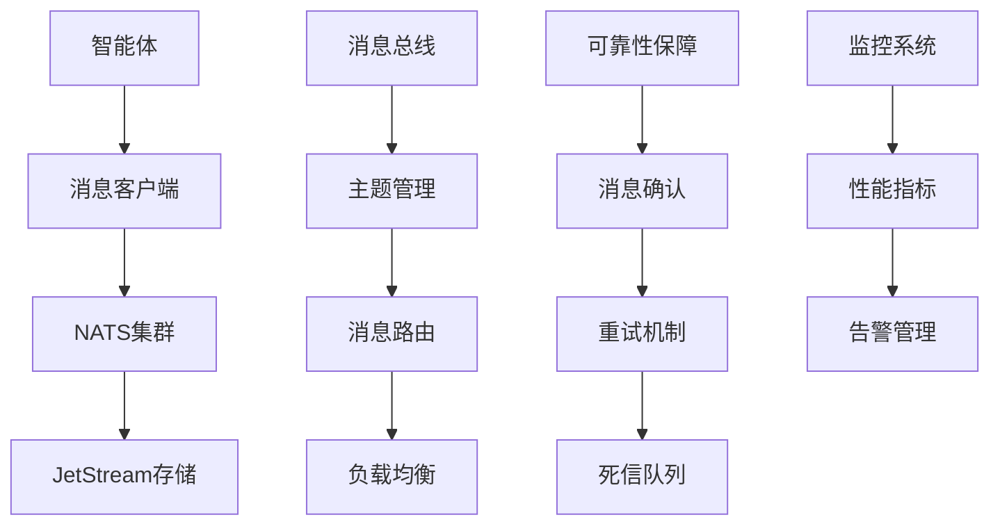

# Story 10.2: 分布式消息通信框架

**Story ID**: STORY-10.2-DISTRIBUTED-MESSAGE-FRAMEWORK  
**Epic**: Epic 10 - 分布式智能体网络  
**优先级**: P1  
**预估工期**: 3周  
**故事点数**: 21  
**负责团队**: 后端团队 + 架构团队

## 📋 用户故事

作为分布式智能体系统的开发者，我需要一个可靠的消息通信框架，能够支持智能体间的实时通信、任务协作和数据交换，确保在大规模分布式环境下的消息传递效率和可靠性，支持智能体的动态协作和集群化工作模式。

### 🎯 用户价值

- **高可用通信**: 基于NATS JetStream的可靠消息传递，99.99%消息投递成功率
- **多种通信模式**: 支持点对点、广播、组播和流式数据传输
- **标准化协议**: 智能体通信语言(ACL)标准，统一消息格式和交互模式
- **性能优异**: 10万消息/秒吞吐量，<5ms平均延迟

## ✅ 验收标准

### 功能要求
- [ ] **消息总线功能**: NATS JetStream集群部署，支持主题管理和消息路由
- [ ] **智能体通信协议**: 标准化ACL消息格式，支持同步/异步处理模式
- [ ] **消息可靠性机制**: 消息持久化、确认机制、重试和死信队列
- [ ] **多种通信模式**: 点对点、广播、组播、流式数据传输
- [ ] **请求-响应机制**: 异步请求-响应，消息关联和超时处理
- [ ] **动态订阅管理**: 动态主题订阅/取消订阅，权限控制

### 技术要求
- [ ] **高性能**: 支持10万消息/秒，平均延迟<5ms
- [ ] **高可靠性**: 消息投递成功率>99.99%，故障恢复<10秒
- [ ] **扩展性**: 支持水平扩展，动态添加NATS节点
- [ ] **安全性**: 支持TLS加密和身份认证
- [ ] **监控能力**: 完整的消息指标监控和告警

### 性能指标
- [ ] **吞吐量**: 峰值处理10万消息/秒
- [ ] **延迟**: P95延迟<10ms，P99延迟<50ms
- [ ] **可用性**: 系统可用性≥99.99%
- [ ] **消息成功率**: 消息投递成功率>99.99%

## 🏗️ 实现方案

### 系统架构



### 核心组件设计

#### 1. NATS消息总线
- **JetStream集成**: 基于NATS JetStream的持久化消息系统
- **主题管理**: 层次化主题结构和动态主题订阅
- **负载均衡**: 消息路由和智能负载分配
- **集群管理**: 多节点集群部署和故障转移

#### 2. 智能体通信协议(ACL)
- **消息格式**: 标准化消息头、载荷和元数据结构
- **消息类型**: 支持任务请求、协作邀请、资源管理等消息类型
- **序列化**: JSON格式消息序列化，支持自定义编解码
- **版本管理**: 协议版本控制和向后兼容

#### 3. 可靠性保障机制
- **消息持久化**: 基于JetStream的消息持久化存储
- **确认机制**: ACK/NACK消息确认和状态跟踪
- **重试策略**: 指数退避重试和最大重试次数限制
- **死信处理**: 失败消息的死信队列处理和监控

#### 4. 通信模式支持
- **点对点通信**: 直接消息传递，支持请求-响应模式
- **广播通信**: 全网广播和组播通信
- **流式传输**: 大数据流式传输和分块处理
- **实时同步**: 实时数据同步和状态更新

### 数据模型

#### 消息头结构 (MessageHeader)
```go
type MessageHeader struct {
    MessageID     string    `json:"message_id"`
    CorrelationID string    `json:"correlation_id,omitempty"`
    ReplyTo       string    `json:"reply_to,omitempty"`
    Timestamp     time.Time `json:"timestamp"`
    TTL           int       `json:"ttl,omitempty"`
    Priority      int       `json:"priority"`
    RetryCount    int       `json:"retry_count"`
}
```

#### 消息体结构 (Message)
```go
type Message struct {
    Header      MessageHeader `json:"header"`
    SenderID    string        `json:"sender_id"`
    ReceiverID  string        `json:"receiver_id,omitempty"`
    MessageType string        `json:"message_type"`
    Payload     interface{}   `json:"payload"`
    Topic       string        `json:"topic,omitempty"`
    RoutingKey  string        `json:"routing_key,omitempty"`
}
```

### API接口设计

#### RESTful API规范
- `POST /communication/send` - 发送点对点消息
- `POST /communication/broadcast` - 发送广播消息
- `POST /communication/request` - 发送请求并等待响应
- `POST /communication/groups/{groupName}/join` - 加入组
- `DELETE /communication/groups/{groupName}/leave` - 离开组
- `POST /communication/handlers` - 注册消息处理器
- `GET /communication/statistics` - 获取通信统计
- `GET /communication/health` - 系统健康检查

#### 消息发送API示例
```python
@app.post("/communication/send")
async def send_message(request: MessageRequest):
    message = Message(
        header=MessageHeader(
            message_id=str(uuid.uuid4()),
            priority=request.priority,
            ttl=request.ttl
        ),
        sender_id=request.sender_id,
        receiver_id=request.receiver_id,
        message_type=request.message_type,
        payload=request.payload
    )
    
    success = await message_bus.send_message(message)
    return {"success": success, "message_id": message.header.message_id}
```

### NATS集群配置

#### 集群配置示例
```yaml
# nats-cluster.yaml
cluster:
  name: agent_cluster
  port: 4248

jetstream:
  enabled: true
  store_dir: "/data/jetstream"
  max_memory_store: 1GB
  max_file_store: 10GB

# 集群节点路由
routes:
  - nats://nats-1:4248
  - nats://nats-2:4248
  - nats://nats-3:4248

# 认证配置
authorization:
  users:
    - user: agent_system
      password: "${NATS_PASSWORD}"
      permissions:
        publish: "agents.>"
        subscribe: "agents.>"
```

## 📋 Tasks / Subtasks

- [ ] **Task 1**: NATS JetStream集群部署 (AC: 1)
  - [ ] 搭建NATS集群环境
  - [ ] 配置JetStream持久化存储
  - [ ] 实现集群高可用和故障转移
  - [ ] 配置认证和权限管理

- [ ] **Task 2**: 基础消息通信实现 (AC: 1, 4)
  - [ ] 实现NATS客户端连接管理
  - [ ] 支持主题订阅和消息发布
  - [ ] 实现消息序列化和反序列化
  - [ ] 基础的点对点消息传递

- [ ] **Task 3**: ACL协议设计和实现 (AC: 2)
  - [ ] 定义智能体通信语言规范
  - [ ] 实现标准化消息格式
  - [ ] 支持不同消息类型和优先级
  - [ ] 消息元数据管理

- [ ] **Task 4**: 消息可靠性保证 (AC: 3)
  - [ ] 实现消息持久化和确认机制
  - [ ] 消息重试和指数退避策略
  - [ ] 死信队列处理和监控
  - [ ] 消息去重和顺序保证

- [ ] **Task 5**: 请求-响应机制 (AC: 5)
  - [ ] 实现异步请求-响应模式
  - [ ] 支持消息关联和超时处理
  - [ ] 实现回调和Promise机制
  - [ ] 并发请求管理和限制

- [ ] **Task 6**: 高级通信模式 (AC: 4, 6)
  - [ ] 实现广播和组播通信
  - [ ] 流式数据传输支持
  - [ ] 消息路由和过滤机制
  - [ ] 动态主题管理

## 🧪 测试策略

### 单元测试
- 消息序列化和反序列化测试
- NATS客户端连接管理测试
- 消息路由和过滤逻辑测试
- API接口功能测试

### 集成测试
- NATS集群集成测试
- 多智能体通信端到端测试
- 消息可靠性和故障恢复测试
- 高并发场景压力测试

### 性能测试
- 消息吞吐量和延迟测试
- 大规模智能体并发通信测试
- 网络分区和故障场景测试
- 长时间运行稳定性测试

### 可靠性测试
- 消息投递成功率测试
- 重试机制和死信处理测试
- 集群故障转移测试
- 数据一致性验证测试

## 📦 部署配置

### Docker Compose配置
```yaml
version: '3.8'
services:
  nats-1:
    image: nats:latest
    command: 
      - "--cluster_name=agent_cluster"
      - "--cluster=nats://0.0.0.0:4248"
      - "--routes=nats://nats-2:4248,nats://nats-3:4248"
      - "--jetstream"
    ports:
      - "4222:4222"
      - "8222:8222"
    volumes:
      - nats_data_1:/data

  nats-2:
    image: nats:latest
    command: 
      - "--cluster_name=agent_cluster"
      - "--cluster=nats://0.0.0.0:4248"
      - "--routes=nats://nats-1:4248,nats://nats-3:4248"
      - "--jetstream"
    ports:
      - "4223:4222"
    volumes:
      - nats_data_2:/data

  message-framework:
    image: message-framework:latest
    environment:
      - NATS_SERVERS=nats://nats-1:4222,nats://nats-2:4222,nats://nats-3:4222
      - CLUSTER_NAME=agent_cluster
    depends_on:
      - nats-1
      - nats-2
      - nats-3
```

### Kubernetes配置
```yaml
apiVersion: apps/v1
kind: StatefulSet
metadata:
  name: nats-cluster
spec:
  serviceName: nats-cluster
  replicas: 3
  template:
    spec:
      containers:
      - name: nats
        image: nats:latest
        resources:
          requests:
            memory: "1Gi"
            cpu: "500m"
          limits:
            memory: "2Gi"
            cpu: "1000m"
        env:
        - name: CLUSTER_ADVERTISE
          value: $(HOSTNAME).nats-cluster.$(NAMESPACE).svc.cluster.local
```

## 📊 监控和告警

### 关键指标
- 消息发送/接收吞吐量和延迟
- NATS集群健康状态和连接数
- 消息投递成功率和错误率
- 队列长度和处理积压
- 系统资源使用率和性能

### 告警规则
- 消息投递失败率超过0.01%
- 平均消息延迟超过10ms
- NATS集群节点故障
- 消息队列积压超过1000条
- 系统可用性低于99.99%

---

**Status**: Draft  
**Created**: 2025-08-30  
**Last Updated**: 2025-08-30  
**Dependencies**: Story 10.1  
**Technical Lead**: 后端团队  
**Stakeholders**: 架构团队, AI平台团队, 运维团队