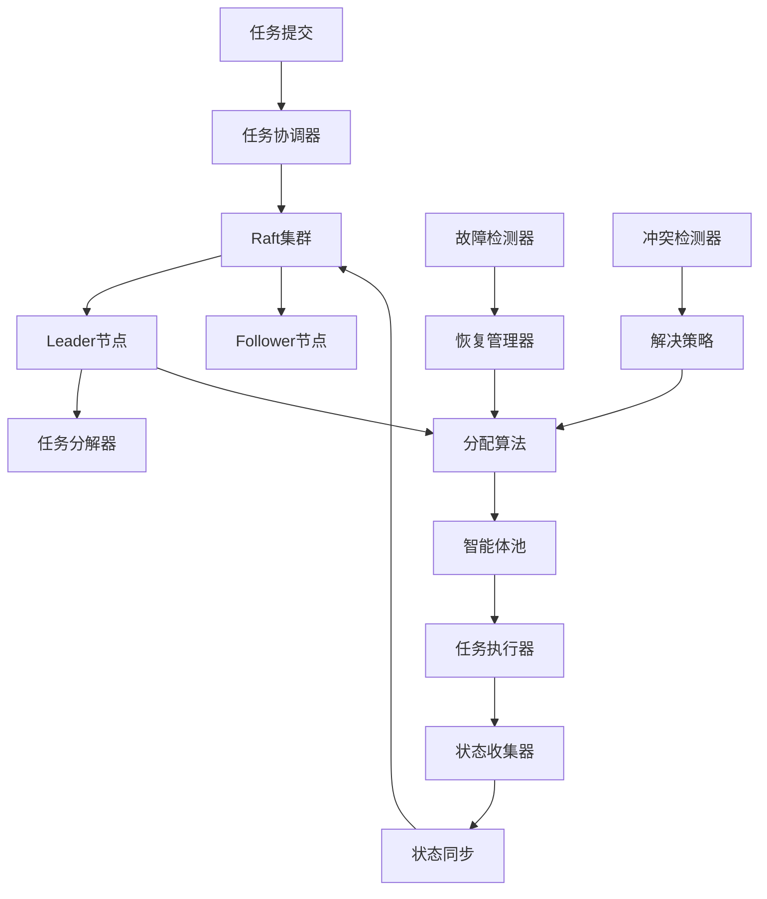

# Story 10.3: 分布式任务协调引擎

**Story ID**: STORY-10.3-DISTRIBUTED-TASK-COORDINATION  
**Epic**: Epic 10 - 分布式智能体网络  
**优先级**: P1  
**预估工期**: 3-4周  
**故事点数**: 21  
**负责团队**: 分布式系统团队

## 📋 用户故事

作为AI系统架构师，我需要实现一个分布式任务协调引擎，基于Raft分布式共识算法实现智能体任务的分布式协调与管理，支持任务分解、智能分配、状态同步和冲突解决，确保在分布式环境下任务执行的一致性和可靠性。

### 🎯 用户价值

- **分布式协调**: 基于Raft共识实现强一致性的任务协调
- **智能分配**: 根据智能体能力和负载自动分配任务
- **故障容错**: 自动检测故障并重新分配任务
- **状态同步**: 分布式任务状态实时同步

## ✅ 验收标准

### 功能要求
- [ ] **Raft共识机制**: 实现完整的Raft选举、日志复制和状态同步
- [ ] **任务分解分配**: 智能任务分解和基于能力的分配算法
- [ ] **状态管理**: 全局任务状态一致性和分布式锁机制
- [ ] **冲突解决**: 任务冲突检测和自动解决策略
- [ ] **故障恢复**: 节点故障检测和任务重新分配
- [ ] **负载均衡**: 动态负载均衡和资源优化

### 技术要求
- [ ] **共识延迟**: Raft共识决策延迟<100ms
- [ ] **吞吐量**: 支持10000+任务/分钟的协调能力
- [ ] **节点扩展**: 支持100+节点的集群规模
- [ ] **可用性**: 系统可用性>99.9%，容忍1/3节点故障
- [ ] **数据一致性**: 强一致性保证，零数据丢失

### 性能指标
- [ ] **任务分配延迟**: 平均任务分配时间<200ms
- [ ] **状态同步延迟**: 状态更新传播延迟<50ms
- [ ] **故障恢复时间**: 节点故障恢复时间<30s
- [ ] **资源利用率**: 集群资源利用率>80%

## 🏗️ 实现方案

### 系统架构



### 核心组件设计

#### 1. Raft共识引擎
- **选举机制**: 自动Leader选举和故障切换
- **日志复制**: 强一致性的状态复制机制
- **成员管理**: 动态集群成员变更支持
- **网络分区**: 脑裂预防和分区容错

#### 2. 任务协调器
- **任务分解**: 复杂任务智能分解为子任务
- **依赖管理**: 任务依赖关系分析和调度
- **分配策略**: 基于能力匹配的智能分配
- **执行监控**: 任务执行进度实时监控

#### 3. 分布式状态管理
- **状态存储**: 分布式状态一致性存储
- **锁管理**: 分布式锁和并发控制
- **事务支持**: 跨节点原子操作支持
- **版本控制**: 状态版本管理和冲突检测

#### 4. 故障恢复系统
- **故障检测**: 节点健康监控和故障识别
- **任务迁移**: 故障节点任务自动迁移
- **状态恢复**: 节点重启后状态快速恢复
- **负载重分配**: 动态负载重新平衡

### 数据模型

#### 任务表 (distributed_tasks)
```sql
CREATE TABLE distributed_tasks (
    id UUID PRIMARY KEY,
    parent_task_id UUID,
    task_type VARCHAR(50) NOT NULL,
    task_data JSONB NOT NULL,
    status VARCHAR(50) NOT NULL,
    assigned_agent_id VARCHAR(255),
    created_at TIMESTAMP WITH TIME ZONE,
    started_at TIMESTAMP WITH TIME ZONE,
    completed_at TIMESTAMP WITH TIME ZONE,
    dependencies JSONB,
    priority INTEGER DEFAULT 0,
    retry_count INTEGER DEFAULT 0
);
```

#### Raft日志表 (raft_log)
```sql
CREATE TABLE raft_log (
    log_index BIGINT PRIMARY KEY,
    term BIGINT NOT NULL,
    command_type VARCHAR(50) NOT NULL,
    command_data JSONB NOT NULL,
    committed BOOLEAN DEFAULT FALSE,
    timestamp TIMESTAMP WITH TIME ZONE DEFAULT NOW()
);
```

#### 集群状态表 (cluster_state)
```sql
CREATE TABLE cluster_state (
    node_id VARCHAR(255) PRIMARY KEY,
    node_role VARCHAR(20) NOT NULL,
    last_heartbeat TIMESTAMP WITH TIME ZONE,
    status VARCHAR(20) NOT NULL,
    load_factor FLOAT DEFAULT 0.0,
    capabilities JSONB
);
```

### API接口设计

#### RESTful API规范
- `POST /api/v1/tasks/distributed` - 提交分布式任务
- `GET /api/v1/tasks/distributed/{id}` - 获取任务状态
- `GET /api/v1/cluster/status` - 获取集群状态
- `GET /api/v1/cluster/nodes` - 获取节点列表
- `POST /api/v1/cluster/nodes/{id}/drain` - 排空节点任务
- `GET /api/v1/coordination/stats` - 获取协调统计
- `POST /api/v1/tasks/{id}/reschedule` - 重新调度任务

### Raft共识算法实现

#### 选举机制
- **Candidate状态**: 节点发起选举成为候选者
- **投票规则**: 基于日志完整性的投票决策
- **Term管理**: 逻辑时钟管理和过期检测
- **Split Vote**: 分裂投票的处理和重选机制

#### 日志复制
- **Entry格式**: 标准化的日志条目格式
- **一致性检查**: 日志一致性验证机制
- **批量复制**: 批量日志复制优化
- **压缩机制**: 日志压缩和快照管理

### 任务分配算法

#### 能力匹配算法
- **能力向量**: 智能体能力多维度量化
- **匹配度计算**: 任务需求与能力的匹配评分
- **约束求解**: 资源约束下的最优分配
- **动态调整**: 基于反馈的分配策略调优

#### 负载均衡策略
- **负载指标**: CPU、内存、网络等多维度负载
- **预测模型**: 任务执行时间预测模型
- **动态重平衡**: 实时负载重分配机制
- **QoS保障**: 不同优先级任务的服务质量保证

### 冲突检测与解决

#### 冲突类型
- **资源竞争**: 多任务竞争同一资源
- **依赖冲突**: 任务依赖关系冲突
- **时序冲突**: 任务执行时序约束冲突
- **状态冲突**: 分布式状态不一致

#### 解决策略
- **优先级规则**: 基于任务优先级的冲突解决
- **时间戳排序**: 基于时间戳的操作排序
- **回滚重试**: 冲突检测后的回滚和重试
- **协商机制**: 多方协商的冲突解决

## 📋 Tasks / Subtasks

- [ ] **Task 1**: 实现Raft共识引擎 (AC: 1)
  - [ ] 实现Raft选举和投票机制
  - [ ] 开发日志复制和一致性检查
  - [ ] 添加网络分区处理
  - [ ] 集成成员变更支持

- [ ] **Task 2**: 构建任务协调器 (AC: 2, 6)
  - [ ] 实现任务分解算法
  - [ ] 开发智能分配引擎
  - [ ] 添加依赖关系管理
  - [ ] 实现负载均衡策略

- [ ] **Task 3**: 开发分布式状态管理 (AC: 3)
  - [ ] 实现分布式状态存储
  - [ ] 添加分布式锁机制
  - [ ] 开发事务支持
  - [ ] 集成版本控制

- [ ] **Task 4**: 构建冲突检测和解决 (AC: 4)
  - [ ] 实现冲突检测算法
  - [ ] 开发解决策略引擎
  - [ ] 添加协商机制
  - [ ] 集成回滚重试

- [ ] **Task 5**: 实现故障恢复系统 (AC: 5)
  - [ ] 开发故障检测机制
  - [ ] 实现任务迁移逻辑
  - [ ] 添加状态恢复功能
  - [ ] 集成自动重分配

- [ ] **Task 6**: 性能优化和测试 (AC: 所有性能指标)
  - [ ] 优化共识算法性能
  - [ ] 实现批处理优化
  - [ ] 添加缓存机制
  - [ ] 进行大规模压力测试

## 🧪 测试策略

### 单元测试
- Raft算法核心逻辑测试
- 任务分配算法正确性测试
- 冲突检测机制测试
- API接口功能测试

### 集成测试
- 多节点Raft集群测试
- 分布式任务协调端到端测试
- 故障恢复流程测试
- 网络分区场景测试

### 性能测试
- 大规模任务并发处理测试
- 高频状态更新性能测试
- 网络延迟影响测试
- 节点扩展性能测试

### 混沌工程
- 随机节点故障测试
- 网络分区模拟测试
- 高负载下的稳定性测试
- 数据一致性验证测试

## 📦 部署配置

### Docker集群配置
```yaml
version: '3.8'
services:
  coordinator-1:
    image: task-coordinator:latest
    environment:
      - NODE_ID=node-1
      - CLUSTER_NODES=node-1,node-2,node-3
      - RAFT_PORT=5000
    ports:
      - "8080:8080"
      - "5000:5000"
  
  coordinator-2:
    image: task-coordinator:latest
    environment:
      - NODE_ID=node-2
      - CLUSTER_NODES=node-1,node-2,node-3
      - RAFT_PORT=5000
    ports:
      - "8081:8080"
      - "5001:5000"
```

### Kubernetes配置
```yaml
apiVersion: apps/v1
kind: StatefulSet
metadata:
  name: task-coordinator
spec:
  replicas: 3
  template:
    spec:
      containers:
      - name: coordinator
        image: task-coordinator:latest
        resources:
          requests:
            memory: "2Gi"
            cpu: "1000m"
          limits:
            memory: "4Gi"
            cpu: "2000m"
        env:
        - name: CLUSTER_SIZE
          value: "3"
```

## 📊 监控和告警

### 关键指标
- Raft选举频率和持续时间
- 任务分配成功率和延迟
- 集群节点健康状态
- 分布式状态一致性
- 系统吞吐量和资源使用

### 告警规则
- Raft选举失败超过3次
- 任务分配延迟超过500ms
- 节点故障率超过10%
- 状态不一致持续超过10s
- 系统可用性低于99%

---

**Status**: Draft  
**Created**: 2025-08-30  
**Last Updated**: 2025-08-30  
**Dependencies**: Story 10.1, 10.2  
**Technical Lead**: 分布式系统团队  
**Stakeholders**: AI平台团队, 运维团队