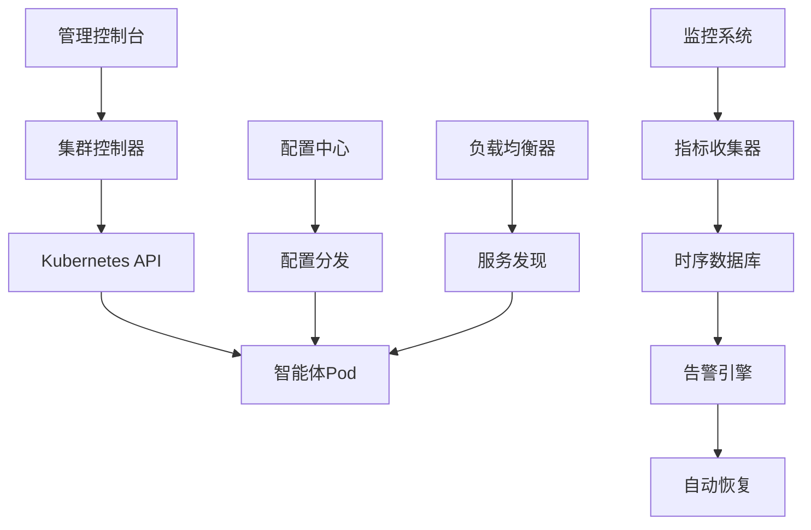

# Story 10.4: 智能体集群管理平台

**Story ID**: STORY-10.4-AGENT-CLUSTER-MGMT  
**Epic**: Epic 10 - 分布式智能体网络  
**优先级**: P1  
**预估工期**: 2-3周  
**故事点数**: 18  
**负责团队**: 运维团队 + 分布式系统团队

## 📋 用户故事

作为系统运维人员和AI平台管理员，我需要一个智能体集群管理平台，能够自动化管理大规模智能体集群的生命周期，包括部署、扩缩容、健康监控和故障恢复，确保智能体服务的高可用性和资源使用效率。

### 🎯 用户价值

- **自动化管理**: 智能体全生命周期自动化，减少90%人工运维
- **弹性扩缩**: 基于负载的自动扩缩容，优化资源利用率
- **故障自愈**: 智能故障检测和自动恢复，系统可用性>99.9%
- **统一监控**: 集群状态可视化，提供运维决策支持

## ✅ 验收标准

### 功能要求
- [ ] **智能体生命周期**: 部署、启动、停止、升级、回滚的完整管理
- [ ] **集群编排**: 基于Kubernetes的智能体集群编排和调度
- [ ] **自动扩缩容**: 基于CPU、内存、队列长度的自动扩缩容
- [ ] **健康监控**: 实时健康检查和服务可用性监控
- [ ] **故障恢复**: 自动故障检测、隔离和服务恢复
- [ ] **配置管理**: 集中化配置管理和动态配置更新

### 技术要求
- [ ] **扩展性**: 支持1000+智能体实例的集群管理
- [ ] **响应速度**: 扩缩容操作响应时间<30秒
- [ ] **监控精度**: 健康检查间隔<10秒，故障检测延迟<30秒
- [ ] **可用性**: 平台自身可用性>99.95%，零单点故障
- [ ] **资源效率**: 集群资源利用率>80%

### 性能指标
- [ ] **部署速度**: 智能体实例部署时间<2分钟
- [ ] **扩容响应**: 负载增加时扩容响应<60秒
- [ ] **故障恢复**: 故障实例恢复或替换<5分钟
- [ ] **配置更新**: 配置变更推送延迟<10秒

## 🏗️ 实现方案

### 系统架构



### 核心组件设计

#### 1. 集群控制器
- **生命周期管理**: 智能体创建、删除、更新操作
- **资源调度**: 基于资源需求的智能调度
- **版本管理**: 滚动更新和版本回滚
- **集群状态**: 集群整体状态管理和同步

#### 2. 自动扩缩容引擎
- **指标监控**: CPU、内存、自定义指标监控
- **扩缩容算法**: 基于阈值和预测的扩缩容决策
- **资源预留**: 预留资源池和快速响应机制
- **成本优化**: 基于成本的资源分配优化

#### 3. 健康监控系统
- **健康检查**: HTTP、TCP、自定义健康检查
- **性能监控**: 延迟、吞吐量、错误率监控
- **告警管理**: 多级告警和通知机制
- **可视化**: 实时仪表板和历史趋势

#### 4. 故障恢复机制
- **故障检测**: 多维度故障检测算法
- **自动隔离**: 故障实例自动隔离和流量切换
- **服务恢复**: 自动重启、重新调度、回滚操作
- **根因分析**: 故障原因分析和预防建议

### 数据模型

#### 集群配置表 (cluster_config)
```sql
CREATE TABLE cluster_config (
    id UUID PRIMARY KEY,
    cluster_name VARCHAR(255) NOT NULL,
    namespace VARCHAR(255) NOT NULL,
    min_replicas INTEGER DEFAULT 1,
    max_replicas INTEGER DEFAULT 10,
    target_cpu_percent INTEGER DEFAULT 70,
    target_memory_percent INTEGER DEFAULT 80,
    health_check_config JSONB,
    created_at TIMESTAMP WITH TIME ZONE
);
```

#### 智能体实例表 (agent_instances)
```sql
CREATE TABLE agent_instances (
    id UUID PRIMARY KEY,
    cluster_id UUID REFERENCES cluster_config(id),
    instance_id VARCHAR(255) NOT NULL,
    status VARCHAR(50) NOT NULL,
    node_name VARCHAR(255),
    cpu_usage FLOAT,
    memory_usage FLOAT,
    last_heartbeat TIMESTAMP WITH TIME ZONE,
    created_at TIMESTAMP WITH TIME ZONE
);
```

### API接口设计

#### RESTful API规范
- `POST /api/v1/clusters` - 创建集群
- `GET /api/v1/clusters` - 列出集群
- `GET /api/v1/clusters/{id}` - 获取集群详情
- `PUT /api/v1/clusters/{id}/scale` - 扩缩容集群
- `POST /api/v1/clusters/{id}/deploy` - 部署新版本
- `POST /api/v1/clusters/{id}/rollback` - 回滚版本
- `GET /api/v1/clusters/{id}/health` - 获取健康状态

#### 集群管理示例
```python
@app.post("/api/v1/clusters")
async def create_cluster(cluster: ClusterConfig):
    cluster_id = await cluster_manager.create_cluster(cluster)
    return {"cluster_id": cluster_id, "status": "creating"}

@app.put("/api/v1/clusters/{cluster_id}/scale")
async def scale_cluster(cluster_id: str, scale_request: ScaleRequest):
    result = await cluster_manager.scale_cluster(
        cluster_id, 
        scale_request.replicas
    )
    return {"status": "scaling", "target_replicas": scale_request.replicas}
```

### Kubernetes配置

#### 智能体Deployment示例
```yaml
apiVersion: apps/v1
kind: Deployment
metadata:
  name: ai-agent-cluster
  namespace: ai-agents
spec:
  replicas: 3
  selector:
    matchLabels:
      app: ai-agent
  template:
    metadata:
      labels:
        app: ai-agent
    spec:
      containers:
      - name: agent
        image: ai-agent:latest
        resources:
          requests:
            memory: "512Mi"
            cpu: "250m"
          limits:
            memory: "1Gi" 
            cpu: "500m"
        readinessProbe:
          httpGet:
            path: /health
            port: 8080
        livenessProbe:
          httpGet:
            path: /health
            port: 8080
```

#### HPA配置
```yaml
apiVersion: autoscaling/v2
kind: HorizontalPodAutoscaler
metadata:
  name: ai-agent-hpa
spec:
  scaleTargetRef:
    apiVersion: apps/v1
    kind: Deployment
    name: ai-agent-cluster
  minReplicas: 1
  maxReplicas: 10
  metrics:
  - type: Resource
    resource:
      name: cpu
      target:
        type: Utilization
        averageUtilization: 70
  - type: Resource
    resource:
      name: memory
      target:
        type: Utilization
        averageUtilization: 80
```

## 📋 Tasks / Subtasks

- [ ] **Task 1**: 构建集群控制器 (AC: 1, 2)
  - [ ] 实现Kubernetes API集成
  - [ ] 开发智能体生命周期管理
  - [ ] 添加资源调度算法
  - [ ] 集成版本管理功能

- [ ] **Task 2**: 实现自动扩缩容 (AC: 3)
  - [ ] 开发指标监控系统
  - [ ] 实现扩缩容决策引擎
  - [ ] 添加成本优化算法
  - [ ] 集成预测性扩缩容

- [ ] **Task 3**: 构建健康监控系统 (AC: 4)
  - [ ] 实现多维度健康检查
  - [ ] 开发性能指标收集
  - [ ] 添加实时告警功能
  - [ ] 集成监控仪表板

- [ ] **Task 4**: 开发故障恢复机制 (AC: 5)
  - [ ] 实现故障检测算法
  - [ ] 开发自动恢复策略
  - [ ] 添加根因分析功能
  - [ ] 集成预防性维护

- [ ] **Task 5**: 实现配置管理系统 (AC: 6)
  - [ ] 构建配置中心
  - [ ] 实现动态配置更新
  - [ ] 添加配置验证机制
  - [ ] 集成配置审计功能

- [ ] **Task 6**: 性能优化和测试 (AC: 所有性能指标)
  - [ ] 优化集群操作性能
  - [ ] 进行大规模集群测试
  - [ ] 实现监控性能调优
  - [ ] 添加压力测试覆盖

## 🧪 测试策略

### 单元测试
- 集群控制器功能测试
- 扩缩容算法正确性测试
- 健康检查机制测试
- API接口功能测试

### 集成测试
- Kubernetes集成测试
- 端到端集群管理流程测试
- 监控系统集成测试
- 故障恢复流程验证

### 性能测试
- 大规模集群管理性能测试
- 高频扩缩容压力测试
- 监控系统性能测试
- 网络和存储性能测试

### 混沌工程
- 节点故障模拟测试
- 网络分区测试
- 资源耗尽场景测试
- 高负载稳定性测试

## 📦 部署配置

### Docker配置
```dockerfile
FROM python:3.9-slim
WORKDIR /app
COPY requirements.txt .
RUN pip install --no-cache-dir -r requirements.txt
COPY src/ .
EXPOSE 8080
CMD ["uvicorn", "main:app", "--host", "0.0.0.0", "--port", "8080"]
```

### Kubernetes部署
```yaml
apiVersion: apps/v1
kind: Deployment
metadata:
  name: cluster-manager
spec:
  replicas: 2
  template:
    spec:
      containers:
      - name: cluster-manager
        image: cluster-manager:latest
        resources:
          requests:
            memory: "1Gi"
            cpu: "500m"
          limits:
            memory: "2Gi" 
            cpu: "1000m"
```

## 📊 监控和告警

### 关键指标
- 集群节点数量和健康状态
- 智能体实例运行状态和资源使用
- 扩缩容操作频率和成功率
- 故障检测和恢复时间
- API操作响应时间和成功率

### 告警规则
- 集群可用性低于99%
- 智能体实例故障率超过5%
- 扩缩容操作失败超过3次
- 资源使用率超过90%
- 故障恢复时间超过10分钟

---

**Status**: Draft  
**Created**: 2025-08-30  
**Last Updated**: 2025-08-30  
**Dependencies**: Story 10.1, 10.2, 10.3  
**Technical Lead**: 运维团队  
**Stakeholders**: AI平台团队, 分布式系统团队, 运维团队