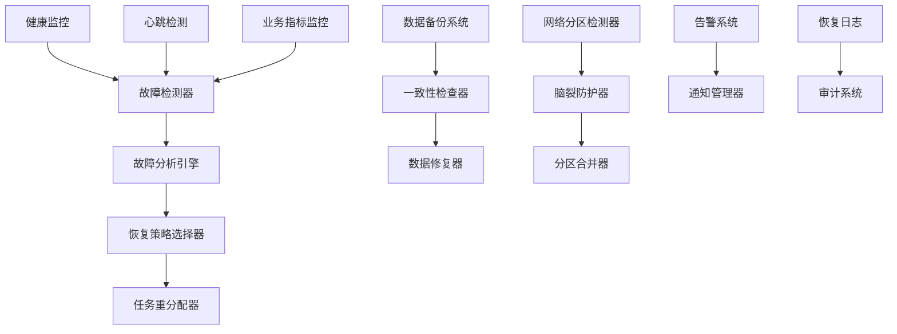

# Story 10.5: 容错和恢复系统

**Story ID**: STORY-10.5-FAULT-TOLERANCE-RECOVERY  
**Epic**: Epic 10 - 分布式智能体网络  
**优先级**: P1  
**预估工期**: 2-3周  
**故事点数**: 16  
**负责团队**: 分布式系统团队

## 📋 用户故事

作为AI系统架构师和运维管理员，我需要构建一个完整的容错和恢复系统，能够自动检测和处理各种故障情况，实现智能体故障检测、任务重分配、分布式备份和网络分区处理，确保分布式智能体系统在故障场景下的高可用性和数据一致性。

### 🎯 用户价值

- **高可用性**: 99.9%+系统可用性，平均故障恢复时间<5分钟
- **数据安全**: 零数据丢失，分布式备份和一致性保障
- **自动恢复**: 90%+故障自动处理，减少人工干预
- **业务连续性**: 故障期间服务降级，保障核心业务

## ✅ 验收标准

### 功能要求
- [ ] **故障检测隔离**: 实时多层次故障检测，自动隔离故障节点
- [ ] **任务重分配**: 故障智能体任务自动重分配和状态恢复
- [ ] **数据备份同步**: 分布式备份、一致性检查和自动修复
- [ ] **网络分区处理**: 网络分区检测、脑裂防护和分区合并
- [ ] **恢复策略**: 多种恢复模式和优先级管理
- [ ] **监控告警**: 全方位故障监控和实时告警通知

### 技术要求
- [ ] **检测延迟**: 故障检测延迟<30秒，隔离响应<60秒
- [ ] **恢复时间**: 平均故障恢复时间<5分钟
- [ ] **数据一致性**: 强一致性保证，备份延迟<10秒
- [ ] **网络分区**: 支持50%以上节点网络分区场景
- [ ] **吞吐量**: 故障处理不影响正常业务50%以上性能

### 性能指标
- [ ] **可用性**: 系统整体可用性>99.9%
- [ ] **故障恢复率**: 自动故障恢复成功率>90%
- [ ] **数据完整性**: 数据丢失率<0.01%
- [ ] **分区容忍性**: 网络分区恢复时间<10分钟

## 🏗️ 实现方案

### 系统架构



### 核心组件设计

#### 1. 故障检测系统
- **多层检测**: 心跳、健康检查、业务指标监控
- **智能分析**: 基于ML的故障模式识别和预测
- **快速响应**: 故障检测延迟<30秒，自动隔离
- **分级处理**: 根据故障严重程度分级处理

#### 2. 任务恢复引擎  
- **任务迁移**: 故障节点任务自动迁移到健康节点
- **状态恢复**: 基于检查点的任务状态快速恢复
- **优先级调度**: 关键任务优先恢复机制
- **资源调度**: 动态资源分配和负载重平衡

#### 3. 数据一致性系统
- **多副本备份**: 分布式数据多副本存储
- **一致性检查**: 定期数据一致性校验和修复
- **版本管理**: 数据版本控制和冲突解决
- **快照机制**: 定期数据快照和恢复点

#### 4. 网络分区处理
- **分区检测**: 基于时间戳和心跳的分区检测
- **脑裂防护**: Quorum机制防止脑裂
- **分区策略**: CAP权衡下的分区处理策略
- **合并机制**: 分区恢复后的数据合并和冲突解决

### 数据模型

#### 故障记录表 (fault_records)
```sql
CREATE TABLE fault_records (
    id UUID PRIMARY KEY,
    node_id VARCHAR(255) NOT NULL,
    fault_type VARCHAR(100) NOT NULL,
    severity_level VARCHAR(50) NOT NULL,
    detected_at TIMESTAMP WITH TIME ZONE,
    resolved_at TIMESTAMP WITH TIME ZONE,
    recovery_action JSONB,
    status VARCHAR(50),
    metadata JSONB
);
```

#### 任务恢复记录 (task_recovery)
```sql
CREATE TABLE task_recovery (
    id UUID PRIMARY KEY,
    original_task_id UUID NOT NULL,
    failed_node_id VARCHAR(255),
    recovery_node_id VARCHAR(255),
    recovery_strategy VARCHAR(100),
    started_at TIMESTAMP WITH TIME ZONE,
    completed_at TIMESTAMP WITH TIME ZONE,
    success BOOLEAN,
    error_message TEXT
);
```

### API接口设计

#### RESTful API规范
- `GET /api/v1/faults/status` - 获取故障系统状态
- `GET /api/v1/faults/records` - 获取故障记录
- `POST /api/v1/recovery/trigger` - 触发手动恢复
- `GET /api/v1/recovery/tasks/{id}` - 获取恢复任务状态
- `GET /api/v1/health/cluster` - 获取集群健康状态
- `POST /api/v1/backup/trigger` - 触发数据备份

#### 故障处理示例
```python
@app.post("/api/v1/recovery/trigger")
async def trigger_recovery(recovery_request: RecoveryRequest):
    recovery_task = await fault_tolerance_service.trigger_recovery(
        node_id=recovery_request.node_id,
        strategy=recovery_request.strategy
    )
    return {
        "recovery_id": recovery_task.id,
        "status": "initiated",
        "estimated_time": recovery_task.estimated_duration
    }

@app.get("/api/v1/health/cluster")
async def get_cluster_health():
    health_status = await health_monitor.get_cluster_status()
    return {
        "overall_health": health_status.overall,
        "healthy_nodes": health_status.healthy_count,
        "failed_nodes": health_status.failed_count,
        "last_updated": health_status.timestamp
    }
```

### 恢复策略配置

#### 故障恢复策略
```yaml
fault_tolerance:
  detection:
    heartbeat_interval: 10s
    health_check_timeout: 5s
    failure_threshold: 3
    recovery_threshold: 2
  
  recovery_strategies:
    fast_recovery:
      max_time: 2m
      resource_limit: 80%
    safe_recovery:
      max_time: 10m
      consistency_check: true
    degraded_service:
      essential_services_only: true
      performance_limit: 50%
  
  backup:
    interval: 5m
    retention_period: 7d
    consistency_check_interval: 1h
```

## 📋 Tasks / Subtasks

- [ ] **Task 1**: 构建故障检测系统 (AC: 1)
  - [ ] 实现多层次健康检查机制
  - [ ] 开发智能故障分析算法
  - [ ] 添加实时监控和告警
  - [ ] 集成自动隔离机制

- [ ] **Task 2**: 开发任务恢复引擎 (AC: 2, 5)
  - [ ] 实现任务状态检查点机制
  - [ ] 开发任务迁移和重分配算法
  - [ ] 添加优先级调度策略
  - [ ] 集成资源动态调度

- [ ] **Task 3**: 构建数据一致性系统 (AC: 3)
  - [ ] 实现分布式备份机制
  - [ ] 开发一致性检查和修复
  - [ ] 添加版本管理和冲突解决
  - [ ] 集成灾难恢复流程

- [ ] **Task 4**: 实现网络分区处理 (AC: 4)
  - [ ] 开发网络分区检测算法
  - [ ] 实现脑裂预防机制
  - [ ] 添加分区合并策略
  - [ ] 集成CAP权衡处理

- [ ] **Task 5**: 集成监控告警系统 (AC: 6)
  - [ ] 构建全方位监控体系
  - [ ] 实现智能告警策略
  - [ ] 添加恢复过程追踪
  - [ ] 集成运维操作审计

- [ ] **Task 6**: 性能优化和测试 (AC: 所有性能指标)
  - [ ] 优化故障检测和恢复性能
  - [ ] 进行大规模故障模拟测试
  - [ ] 实现混沌工程测试
  - [ ] 添加性能监控和调优

## 🧪 测试策略

### 单元测试
- 故障检测算法准确性测试
- 任务恢复逻辑正确性测试
- 数据一致性检查测试
- API接口功能测试

### 集成测试
- 端到端故障恢复流程测试
- 多节点故障场景测试
- 网络分区和恢复测试
- 数据备份和恢复测试

### 混沌工程测试
- 随机节点故障注入
- 网络延迟和分区模拟
- 磁盘故障和数据损坏
- 高负载下的故障恢复

### 性能测试
- 大规模集群故障测试
- 高频故障场景测试
- 恢复时间和吞吐量测试
- 长时间稳定性测试

## 📦 部署配置

### Docker配置
```dockerfile
FROM python:3.9-slim
WORKDIR /app
COPY requirements.txt .
RUN pip install --no-cache-dir -r requirements.txt
COPY src/ .
EXPOSE 8080
CMD ["uvicorn", "fault_tolerance:app", "--host", "0.0.0.0", "--port", "8080"]
```

### Kubernetes配置
```yaml
apiVersion: apps/v1
kind: Deployment
metadata:
  name: fault-tolerance-system
spec:
  replicas: 3
  template:
    spec:
      containers:
      - name: fault-tolerance
        image: fault-tolerance:latest
        resources:
          requests:
            memory: "1Gi"
            cpu: "500m"
          limits:
            memory: "2Gi"
            cpu: "1000m"
        livenessProbe:
          httpGet:
            path: /health
            port: 8080
        readinessProbe:
          httpGet:
            path: /ready
            port: 8080
```

## 📊 监控和告警

### 关键指标
- 系统整体可用性和故障检测延迟
- 故障恢复成功率和恢复时间
- 数据备份完整性和一致性
- 网络分区处理效果和合并时间
- 任务重分配成功率和性能影响

### 告警规则
- 系统可用性低于99.9%
- 故障检测延迟超过30秒
- 故障恢复失败率超过10%
- 数据不一致性持续超过1分钟
- 网络分区持续超过5分钟

---

**Status**: Draft  
**Created**: 2025-08-30  
**Last Updated**: 2025-08-30  
**Dependencies**: Story 10.1, 10.2, 10.3, 10.4  
**Technical Lead**: 分布式系统团队  
**Stakeholders**: 运维团队, AI平台团队, 架构团队