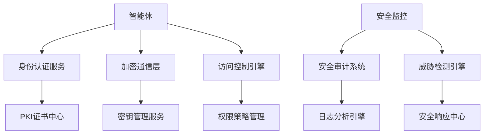

# Story 10.6: 分布式安全框架

**Story ID**: STORY-10.6-DISTRIBUTED-SECURITY  
**Epic**: Epic 10 - 分布式智能体网络  
**优先级**: P1  
**预估工期**: 2周  
**故事点数**: 14  
**负责团队**: 安全架构团队 + 分布式系统团队

## 📋 用户故事

作为分布式系统安全架构师，我需要构建一个企业级分布式安全框架，为智能体网络提供全面安全保护，包括身份认证、消息加密、访问控制和威胁检测，确保分布式系统的安全性和可信度。

### 🎯 用户价值

- **零信任安全**: 基于零信任架构的全方位安全防护
- **端到端加密**: 智能体间通信的端到端加密保护
- **实时威胁检测**: AI驱动的安全威胁实时检测和响应
- **合规保障**: 满足企业安全标准和数据保护法规

## ✅ 验收标准

### 功能要求
- [ ] **身份认证授权**: 基于PKI的智能体身份认证和动态授权
- [ ] **端到端加密**: 消息传输和存储的加密保护
- [ ] **访问控制**: 细粒度的资源访问控制和权限管理
- [ ] **安全审计**: 完整的安全操作审计和合规报告
- [ ] **威胁检测**: 实时安全威胁检测和自动响应
- [ ] **密钥管理**: 分布式密钥管理和轮换机制

### 技术要求
- [ ] **认证延迟**: 智能体身份认证延迟<500ms
- [ ] **加密性能**: 消息加密解密性能损失<10%
- [ ] **威胁检测**: 威胁检测准确率>95%，误报率<1%
- [ ] **安全更新**: 安全策略更新推送延迟<30秒
- [ ] **合规覆盖**: 安全审计覆盖率100%

### 性能指标
- [ ] **身份验证**: 支持10000+智能体并发认证
- [ ] **加密吞吐量**: 加密消息吞吐量>50000 msg/s
- [ ] **威胁响应**: 安全威胁响应时间<60秒
- [ ] **系统可用性**: 安全系统可用性>99.95%

## 🏗️ 实现方案

### 系统架构



### 核心组件设计

#### 1. 身份认证系统
- **PKI基础设施**: X.509证书管理和验证
- **零信任验证**: 基于设备指纹和行为分析
- **多因子认证**: 支持多种认证因子组合
- **动态信任评估**: 实时信任级别评估和调整

#### 2. 加密通信系统
- **端到端加密**: AES-256和RSA-4096混合加密
- **前向保密**: 完美前向保密协议实现
- **消息完整性**: 数字签名和HMAC完整性校验
- **密钥轮换**: 自动密钥生成和轮换机制

#### 3. 访问控制引擎
- **RBAC模型**: 基于角色的访问控制
- **ABAC策略**: 基于属性的动态访问控制
- **资源隔离**: 多租户资源隔离和保护
- **策略执行**: 分布式策略执行和同步

#### 4. 威胁检测系统
- **行为分析**: 基于ML的异常行为检测
- **入侵检测**: 实时网络和主机入侵检测
- **威胁情报**: 外部威胁情报集成和分析
- **自动响应**: 威胁自动隔离和缓解机制

### 数据模型

#### 身份认证表 (identity_auth)
```sql
CREATE TABLE identity_auth (
    id UUID PRIMARY KEY,
    agent_id VARCHAR(255) UNIQUE NOT NULL,
    certificate_hash VARCHAR(256) NOT NULL,
    trust_level INTEGER DEFAULT 50,
    last_verified TIMESTAMP WITH TIME ZONE,
    auth_status VARCHAR(50),
    metadata JSONB,
    created_at TIMESTAMP WITH TIME ZONE
);
```

#### 安全审计表 (security_audit)
```sql
CREATE TABLE security_audit (
    id UUID PRIMARY KEY,
    event_type VARCHAR(100) NOT NULL,
    agent_id VARCHAR(255),
    resource_id VARCHAR(255),
    action VARCHAR(100),
    result VARCHAR(50),
    timestamp TIMESTAMP WITH TIME ZONE,
    ip_address INET,
    metadata JSONB
);
```

### API接口设计

#### RESTful API规范
- `POST /api/v1/auth/authenticate` - 智能体身份认证
- `GET /api/v1/auth/status` - 获取认证状态
- `POST /api/v1/crypto/encrypt` - 消息加密服务
- `GET /api/v1/access/check` - 访问权限检查
- `GET /api/v1/audit/events` - 获取审计事件
- `POST /api/v1/threats/report` - 威胁事件上报

#### 安全认证示例
```python
@app.post("/api/v1/auth/authenticate")
async def authenticate_agent(auth_request: AuthRequest):
    cert_valid = await pki_service.verify_certificate(auth_request.certificate)
    if not cert_valid:
        raise HTTPException(status_code=401, detail="Invalid certificate")
    
    trust_score = await trust_engine.evaluate_trust(auth_request.agent_id)
    if trust_score < MINIMUM_TRUST_THRESHOLD:
        raise HTTPException(status_code=403, detail="Insufficient trust level")
    
    token = await jwt_service.generate_token(auth_request.agent_id)
    return {"access_token": token, "trust_level": trust_score}
```

### 安全配置

#### 加密配置
```yaml
security:
  encryption:
    algorithm: "AES-256-GCM"
    key_rotation_interval: "24h"
    forward_secrecy: true
  
  authentication:
    certificate_validity: "30d"
    trust_threshold: 70
    mfa_required: true
  
  access_control:
    default_policy: "deny"
    policy_update_interval: "5m"
    session_timeout: "1h"
```

## 📋 Tasks / Subtasks

- [ ] **Task 1**: 构建身份认证系统 (AC: 1)
  - [ ] 实现PKI证书管理
  - [ ] 开发零信任验证机制
  - [ ] 添加多因子认证支持
  - [ ] 集成动态信任评估

- [ ] **Task 2**: 实现加密通信系统 (AC: 2, 6)
  - [ ] 开发端到端加密协议
  - [ ] 实现密钥管理服务
  - [ ] 添加前向保密机制
  - [ ] 集成消息完整性校验

- [ ] **Task 3**: 构建访问控制引擎 (AC: 3)
  - [ ] 实现RBAC和ABAC模型
  - [ ] 开发策略管理系统
  - [ ] 添加资源隔离机制
  - [ ] 集成分布式策略执行

- [ ] **Task 4**: 开发安全审计系统 (AC: 4)
  - [ ] 实现审计日志收集
  - [ ] 开发合规报告生成
  - [ ] 添加审计数据分析
  - [ ] 集成取证支持

- [ ] **Task 5**: 构建威胁检测系统 (AC: 5)
  - [ ] 实现行为分析引擎
  - [ ] 开发入侵检测系统
  - [ ] 添加威胁情报集成
  - [ ] 集成自动响应机制

- [ ] **Task 6**: 性能优化和测试 (AC: 所有性能指标)
  - [ ] 优化加密性能
  - [ ] 进行安全渗透测试
  - [ ] 实现合规验证测试
  - [ ] 添加压力测试覆盖

## 🧪 测试策略

### 安全测试
- 渗透测试和漏洞扫描
- 加密算法安全性验证
- 身份认证绕过测试
- 访问控制逃逸测试

### 性能测试
- 高并发认证性能测试
- 加密解密性能基准测试
- 威胁检测响应时间测试
- 系统负载和稳定性测试

### 合规测试
- 安全标准合规验证
- 审计功能完整性测试
- 数据保护法规遵从测试
- 安全策略覆盖测试

## 📦 部署配置

### Docker安全配置
```dockerfile
FROM python:3.9-slim
RUN addgroup --system security && adduser --system --group security
WORKDIR /app
COPY requirements.txt .
RUN pip install --no-cache-dir -r requirements.txt
COPY src/ .
USER security
EXPOSE 8443
CMD ["uvicorn", "security:app", "--host", "0.0.0.0", "--port", "8443", "--ssl-keyfile=/certs/key.pem", "--ssl-certfile=/certs/cert.pem"]
```

### Kubernetes配置
```yaml
apiVersion: apps/v1
kind: Deployment
metadata:
  name: security-framework
spec:
  replicas: 3
  template:
    spec:
      containers:
      - name: security
        image: security-framework:latest
        securityContext:
          runAsNonRoot: true
          runAsUser: 1000
          readOnlyRootFilesystem: true
        resources:
          requests:
            memory: "512Mi"
            cpu: "250m"
          limits:
            memory: "1Gi"
            cpu: "500m"
```

## 📊 监控和告警

### 关键指标
- 身份认证成功率和失败原因分析
- 加密通信性能和密钥轮换状态
- 访问控制策略执行效果
- 威胁检测准确率和响应时间
- 安全审计覆盖率和合规状态

### 告警规则
- 身份认证失败率超过5%
- 加密性能下降超过20%
- 检测到安全威胁或异常行为
- 访问控制策略违规
- 安全审计数据丢失或异常

---

**Status**: Draft  
**Created**: 2025-08-30  
**Last Updated**: 2025-08-30  
**Dependencies**: Story 10.1, 10.2, 10.3, 10.4, 10.5  
**Technical Lead**: 安全架构团队  
**Stakeholders**: 分布式系统团队, 合规团队, 运维团队