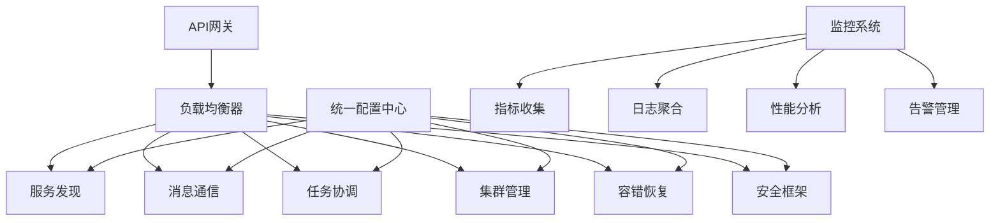

# Story 10.7: 系统集成和性能优化

**Story ID**: STORY-10.7-SYSTEM-INTEGRATION  
**Epic**: Epic 10 - 分布式智能体网络  
**优先级**: P1  
**预估工期**: 3周  
**故事点数**: 21  
**负责团队**: 系统架构团队 + 性能优化团队

## 📋 用户故事

作为系统架构师和性能优化工程师，我需要完成分布式智能体网络的系统集成和性能优化，整合所有子系统，建立统一的监控和优化机制，确保整个分布式网络在生产环境下的高性能、高可用和可扩展性。

### 🎯 用户价值

- **端到端集成**: 所有分布式组件无缝集成，形成统一网络
- **性能保障**: 系统整体性能提升40%+，响应延迟<100ms
- **运维统一**: 统一监控管理，运维效率提升60%+
- **弹性扩展**: 支持1000+智能体的动态扩缩容

## ✅ 验收标准

### 功能要求
- [ ] **系统集成**: 所有Epic 10子系统完整集成和互联互通
- [ ] **统一配置**: 集中化配置管理和动态配置同步
- [ ] **性能优化**: 网络吞吐量、延迟、资源利用率全面优化
- [ ] **监控统一**: 统一监控仪表板和告警管理
- [ ] **自动化部署**: 完整的CI/CD和自动化部署流程
- [ ] **压力测试**: 大规模负载测试和性能基准验证

### 技术要求
- [ ] **网络延迟**: 跨智能体通信延迟<100ms
- [ ] **系统吞吐**: 网络消息处理吞吐量>100k msg/s
- [ ] **资源效率**: CPU利用率<80%，内存利用率<85%
- [ ] **可扩展性**: 支持100-1000智能体动态扩缩容
- [ ] **可用性**: 系统整体可用性>99.9%

### 性能指标
- [ ] **响应时间**: API响应时间P95<200ms
- [ ] **故障恢复**: 系统故障恢复时间<5分钟
- [ ] **部署时间**: 完整系统部署时间<30分钟
- [ ] **监控覆盖**: 监控指标覆盖率100%

## 🏗️ 实现方案

### 系统架构



### 核心组件设计

#### 1. 系统集成器
- **组件编排**: 自动发现和注册各子系统组件
- **依赖管理**: 服务间依赖关系管理和启动顺序
- **健康检查**: 集成各组件的健康检查和状态监控
- **版本管理**: 统一的版本管理和兼容性保证

#### 2. 性能优化引擎
- **瓶颈识别**: 自动识别系统性能瓶颈和热点
- **资源优化**: 动态资源分配和负载均衡优化
- **缓存策略**: 多级缓存和智能缓存策略
- **网络优化**: 消息路由和传输协议优化

#### 3. 统一监控平台
- **指标聚合**: 各组件指标统一收集和聚合
- **实时监控**: 实时性能监控和可视化展示
- **智能告警**: 基于ML的智能告警和异常检测
- **运维操作**: 统一运维操作界面和自动化脚本

#### 4. 自动化部署系统
- **CI/CD流水线**: 完整的持续集成和部署流水线
- **环境管理**: 开发、测试、生产环境统一管理
- **灰度发布**: 安全的灰度发布和回滚机制
- **配置管理**: 环境配置和密钥管理

### 数据模型

#### 系统集成配置表 (system_config)
```sql
CREATE TABLE system_config (
    id UUID PRIMARY KEY,
    component_name VARCHAR(255) NOT NULL,
    config_key VARCHAR(255) NOT NULL,
    config_value TEXT,
    environment VARCHAR(100),
    version VARCHAR(50),
    updated_at TIMESTAMP WITH TIME ZONE,
    updated_by VARCHAR(255)
);
```

#### 性能指标表 (performance_metrics)
```sql
CREATE TABLE performance_metrics (
    id UUID PRIMARY KEY,
    metric_name VARCHAR(255) NOT NULL,
    metric_value FLOAT NOT NULL,
    component_name VARCHAR(255),
    timestamp TIMESTAMP WITH TIME ZONE,
    tags JSONB,
    metadata JSONB
);
```

### API接口设计

#### RESTful API规范
- `GET /api/v1/system/status` - 获取系统整体状态
- `GET /api/v1/system/metrics` - 获取系统性能指标
- `POST /api/v1/system/optimize` - 触发性能优化
- `GET /api/v1/config/components` - 获取组件配置
- `PUT /api/v1/config/components/{name}` - 更新组件配置
- `GET /api/v1/deployment/status` - 获取部署状态

#### 系统监控示例
```python
@app.get("/api/v1/system/status")
async def get_system_status():
    components = await integration_service.get_all_components()
    overall_health = await health_checker.check_overall_health()
    
    return {
        "overall_status": overall_health.status,
        "components": [
            {
                "name": comp.name,
                "status": comp.status,
                "version": comp.version,
                "health": comp.health_score
            } for comp in components
        ],
        "last_updated": datetime.utcnow()
    }
```

### 性能优化配置

#### 系统优化策略
```yaml
optimization:
  performance:
    cache:
      redis_cluster: true
      cache_ttl: 3600
      max_memory: "2GB"
    
    load_balancing:
      algorithm: "weighted_round_robin"
      health_check_interval: 30
      max_connections_per_node: 1000
    
    resource_limits:
      cpu_limit_percent: 80
      memory_limit_percent: 85
      disk_usage_limit_percent: 90
  
  monitoring:
    metrics_retention: "30d"
    sampling_rate: 0.1
    alert_cooldown: "5m"
```

## 📋 Tasks / Subtasks

- [ ] **Task 1**: 完成系统集成 (AC: 1, 2)
  - [ ] 集成所有Epic 10子系统
  - [ ] 实现组件间通信协议
  - [ ] 建立统一配置管理
  - [ ] 验证端到端功能

- [ ] **Task 2**: 实现性能优化 (AC: 3)
  - [ ] 进行系统性能基准测试
  - [ ] 识别和解决性能瓶颈
  - [ ] 优化关键路径性能
  - [ ] 实现智能资源调度

- [ ] **Task 3**: 构建监控平台 (AC: 4)
  - [ ] 实现统一监控仪表板
  - [ ] 集成各组件监控指标
  - [ ] 开发智能告警系统
  - [ ] 添加性能分析工具

- [ ] **Task 4**: 建立自动化部署 (AC: 5)
  - [ ] 构建CI/CD流水线
  - [ ] 实现自动化测试集成
  - [ ] 开发灰度发布机制
  - [ ] 集成环境配置管理

- [ ] **Task 5**: 进行压力测试 (AC: 6)
  - [ ] 设计大规模压力测试方案
  - [ ] 执行性能基准测试
  - [ ] 验证扩缩容能力
  - [ ] 测试故障恢复能力

- [ ] **Task 6**: 系统调优和上线 (AC: 所有性能指标)
  - [ ] 根据测试结果进行调优
  - [ ] 完成生产环境部署
  - [ ] 建立运维操作手册
  - [ ] 进行用户培训和交付

## 🧪 测试策略

### 集成测试
- 端到端系统功能测试
- 跨组件交互测试
- 配置管理集成测试
- 故障场景集成测试

### 性能测试
- 大规模并发压力测试
- 网络延迟和吞吐量测试
- 资源利用率测试
- 扩缩容性能测试

### 可靠性测试
- 长时间稳定性测试
- 故障注入和恢复测试
- 网络分区测试
- 数据一致性测试

### 生产环境测试
- 灰度发布测试
- 回滚机制测试
- 监控告警测试
- 运维操作测试

## 📦 部署配置

### Docker Compose集成
```yaml
version: '3.8'
services:
  api-gateway:
    image: nginx:alpine
    ports:
      - "80:80"
      - "443:443"
    depends_on:
      - service-discovery
      - message-framework
      - task-coordinator
  
  monitoring:
    image: prometheus:latest
    ports:
      - "9090:9090"
    volumes:
      - ./prometheus.yml:/etc/prometheus/prometheus.yml
```

### Kubernetes生产配置
```yaml
apiVersion: v1
kind: Namespace
metadata:
  name: distributed-agents
---
apiVersion: apps/v1
kind: Deployment
metadata:
  name: system-integration
  namespace: distributed-agents
spec:
  replicas: 3
  template:
    spec:
      containers:
      - name: integration
        image: system-integration:latest
        resources:
          requests:
            memory: "2Gi"
            cpu: "1000m"
          limits:
            memory: "4Gi"
            cpu: "2000m"
```

## 📊 监控和告警

### 关键指标
- 系统整体可用性和响应时间
- 各组件健康状态和性能指标
- 网络吞吐量和消息延迟
- 资源利用率和扩缩容状态
- 错误率和故障恢复时间

### 告警规则
- 系统可用性低于99.9%
- 任意组件响应时间超过500ms
- 网络消息延迟超过100ms
- 资源利用率超过配置阈值
- 系统错误率超过1%

---

**Status**: Draft  
**Created**: 2025-08-30  
**Last Updated**: 2025-08-30  
**Dependencies**: Epic 10.1-10.6全部完成  
**Technical Lead**: 系统架构团队  
**Stakeholders**: 性能优化团队, 运维团队, AI平台团队