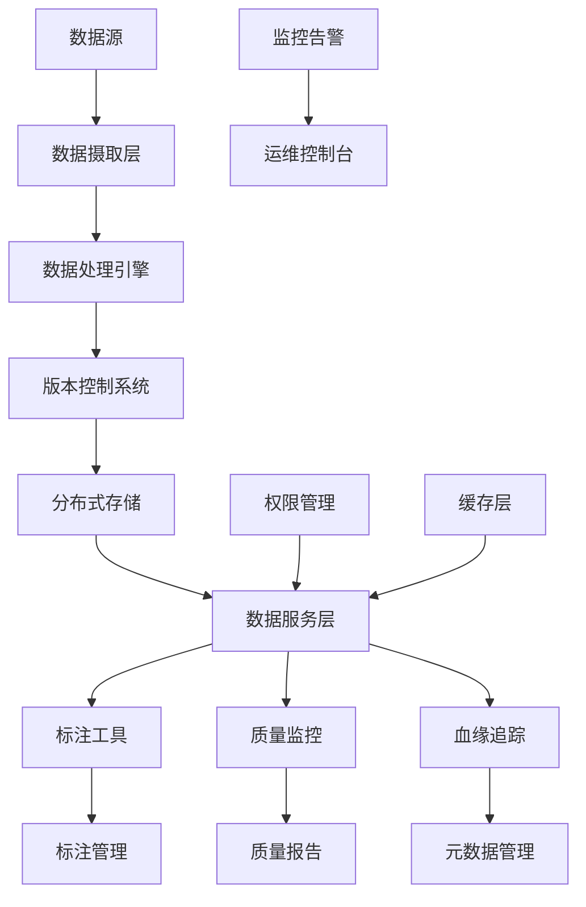

# Story 9.5: 训练数据管理系统

**Story ID**: STORY-9.5-TRAINING-DATA-MGMT  
**Epic**: Epic 9 - 模型微调和优化平台  
**优先级**: P1  
**预估工期**: 2周  
**故事点数**: 11  
**负责团队**: AI团队

## 📋 用户故事

作为AI系统开发者，我希望拥有一套完整的训练数据管理系统，能够高效管理大规模训练数据集，支持数据版本控制、质量监控和智能标注，为模型训练提供高质量数据支撑。

### 🎯 用户价值

- **数据质量**: 智能数据质量监控和清理，确保训练数据高质量
- **版本管理**: 完整的数据版本控制，支持数据血缘追踪和回滚
- **标注效率**: 智能标注工具和质量控制，提升50%+标注效率
- **存储优化**: 分布式存储和压缩优化，降低60%存储成本

## ✅ 验收标准

### 功能要求
- [ ] **数据摄取**: 支持批量和流式数据摄取，多种格式兼容
- [ ] **版本控制**: 完整的数据版本管理，支持分支、合并、回滚
- [ ] **质量监控**: 自动数据质量检测，异常数据标识和处理
- [ ] **智能标注**: 半自动标注工具，支持主动学习和标注质量控制
- [ ] **数据血缘**: 完整的数据处理链路追踪和影响分析
- [ ] **访问控制**: 细粒度权限管理和数据安全保护

### 技术要求
- [ ] **存储容量**: 支持PB级数据存储和管理
- [ ] **处理性能**: TB级数据处理性能<6小时
- [ ] **并发支持**: 支持1000+用户并发访问
- [ ] **可用性**: 数据可用性99.9%，零数据丢失
- [ ] **扩展性**: 支持水平扩展和弹性伸缩

### 性能指标
- [ ] **摄取速度**: 数据摄取速度>10GB/min
- [ ] **查询延迟**: 数据查询平均延迟<500ms
- [ ] **存储效率**: 数据压缩比>70%
- [ ] **标注速度**: 智能预标注准确率>85%

## 🏗️ 实现方案

### 系统架构



### 核心组件设计

#### 1. 数据摄取层
- **批量摄取**: 支持大文件批量导入，断点续传
- **流式摄取**: 实时数据流处理，支持Kafka、Pulsar
- **格式适配**: 支持CSV、JSON、Parquet、图像、音频等格式
- **数据校验**: 摄取过程中的数据格式和完整性校验

#### 2. 版本控制系统
- **版本管理**: 基于Git模型的数据版本控制
- **分支策略**: 支持特性分支、发布分支的数据管理
- **增量更新**: 智能增量更新，减少存储和传输开销
- **合并策略**: 数据合并冲突检测和解决

#### 3. 数据处理引擎
- **清洗流水线**: 可配置的数据清洗和预处理流水线
- **去重检测**: 智能重复数据检测和处理
- **格式转换**: 多种数据格式间的转换和标准化
- **采样策略**: 智能数据采样和子集生成

#### 4. 智能标注系统
- **标注工具**: 支持文本、图像、音频的标注界面
- **主动学习**: 基于不确定性的样本选择策略
- **质量控制**: 标注质量评估和审核机制
- **协作标注**: 多人协作标注和任务分配

### 数据模型

#### 数据集表 (datasets)
```sql
CREATE TABLE datasets (
    id UUID PRIMARY KEY,
    name VARCHAR(255) NOT NULL,
    description TEXT,
    data_type VARCHAR(50) NOT NULL,
    version VARCHAR(50),
    size_bytes BIGINT,
    record_count BIGINT,
    created_at TIMESTAMP WITH TIME ZONE,
    updated_at TIMESTAMP WITH TIME ZONE,
    created_by UUID,
    metadata JSONB
);
```

#### 数据版本表 (data_versions)
```sql
CREATE TABLE data_versions (
    id UUID PRIMARY KEY,
    dataset_id UUID REFERENCES datasets(id),
    version_tag VARCHAR(100) NOT NULL,
    parent_version UUID,
    changes_summary TEXT,
    commit_hash VARCHAR(64),
    created_at TIMESTAMP WITH TIME ZONE,
    created_by UUID,
    metadata JSONB
);
```

#### 标注任务表 (annotation_tasks)
```sql
CREATE TABLE annotation_tasks (
    id UUID PRIMARY KEY,
    dataset_id UUID REFERENCES datasets(id),
    task_type VARCHAR(50) NOT NULL,
    instructions TEXT,
    status VARCHAR(50),
    assignee UUID,
    progress FLOAT DEFAULT 0,
    quality_score FLOAT,
    created_at TIMESTAMP WITH TIME ZONE,
    completed_at TIMESTAMP WITH TIME ZONE
);
```

### API接口设计

#### RESTful API规范
- `POST /api/v1/datasets` - 创建数据集
- `GET /api/v1/datasets` - 列出数据集
- `GET /api/v1/datasets/{id}` - 获取数据集详情
- `POST /api/v1/datasets/{id}/versions` - 创建新版本
- `GET /api/v1/datasets/{id}/versions` - 获取版本历史
- `POST /api/v1/datasets/{id}/upload` - 上传数据文件
- `GET /api/v1/datasets/{id}/download` - 下载数据集
- `POST /api/v1/annotation/tasks` - 创建标注任务
- `GET /api/v1/annotation/tasks/{id}` - 获取标注进度

### 数据质量监控

#### 质量指标
- **完整性检查**: 缺失值、异常值检测
- **一致性验证**: 数据格式、类型一致性
- **准确性评估**: 标注质量和数据正确性
- **时效性监控**: 数据更新频率和延迟

#### 监控规则
- 缺失值比例超过5%触发告警
- 数据格式错误超过1%触发告警
- 标注质量评分低于90%触发审核
- 数据更新延迟超过24小时触发通知

### 智能标注工具

#### 标注类型支持
- **文本标注**: 分类、实体识别、情感分析
- **图像标注**: 目标检测、语义分割、分类
- **音频标注**: 语音识别、音频分类、情感识别
- **多模态标注**: 跨模态关联标注

#### 主动学习策略
- **不确定性采样**: 选择模型最不确定的样本
- **代表性采样**: 选择具有代表性的样本集
- **多样性采样**: 确保样本的多样性和覆盖度
- **增量学习**: 基于新标注数据的模型更新

## 📋 Tasks / Subtasks

- [ ] **Task 1**: 构建数据摄取和存储系统 (AC: 1)
  - [ ] 实现多格式数据摄取接口
  - [ ] 集成分布式存储系统
  - [ ] 添加数据压缩和去重功能
  - [ ] 实现断点续传机制

- [ ] **Task 2**: 开发版本控制系统 (AC: 2, 5)
  - [ ] 实现数据版本管理核心
  - [ ] 添加分支和合并功能
  - [ ] 开发数据血缘追踪
  - [ ] 实现增量更新机制

- [ ] **Task 3**: 构建数据质量监控 (AC: 3)
  - [ ] 实现数据质量检测算法
  - [ ] 开发质量监控仪表板
  - [ ] 添加异常检测和告警
  - [ ] 集成数据清洗流水线

- [ ] **Task 4**: 开发智能标注系统 (AC: 4)
  - [ ] 构建标注工具界面
  - [ ] 实现主动学习算法
  - [ ] 添加标注质量控制
  - [ ] 开发协作标注功能

- [ ] **Task 5**: 实现权限管理和安全 (AC: 6)
  - [ ] 设计细粒度权限模型
  - [ ] 实现数据访问控制
  - [ ] 添加审计日志功能
  - [ ] 集成数据加密保护

- [ ] **Task 6**: 性能优化和扩展性 (AC: 所有技术要求)
  - [ ] 优化查询和访问性能
  - [ ] 实现缓存策略
  - [ ] 添加水平扩展支持
  - [ ] 进行大规模性能测试

## 🧪 测试策略

### 单元测试
- 数据摄取和处理功能测试
- 版本控制算法正确性测试
- 质量检测准确性测试
- API接口功能测试

### 集成测试
- 端到端数据管理流程测试
- 多用户并发访问测试
- 大规模数据处理测试
- 系统集成稳定性测试

### 性能测试
- PB级数据存储性能测试
- 高并发查询响应测试
- 网络带宽和IO性能测试
- 扩展性和弹性测试

### 安全测试
- 权限访问控制测试
- 数据泄露防护测试
- 审计日志完整性测试
- 数据加密传输测试

## 📦 部署配置

### 分布式存储配置
```yaml
services:
  minio-cluster:
    image: minio/minio:latest
    command: server /data{1...4}
    environment:
      - MINIO_ROOT_USER=admin
      - MINIO_ROOT_PASSWORD=password
    volumes:
      - minio_data:/data
    deploy:
      replicas: 4
```

### Kubernetes配置
```yaml
apiVersion: apps/v1
kind: Deployment
metadata:
  name: data-management-system
spec:
  replicas: 3
  template:
    spec:
      containers:
      - name: data-service
        image: data-management:latest
        resources:
          requests:
            memory: "4Gi"
            cpu: "2000m"
          limits:
            memory: "8Gi"
            cpu: "4000m"
```

## 📊 监控和告警

### 关键指标
- 数据摄取速度和成功率
- 存储使用率和增长趋势
- 查询响应时间和吞吐量
- 标注任务完成率和质量
- 系统可用性和错误率

### 告警规则
- 数据摄取失败率超过1%
- 存储使用率超过80%
- 查询延迟超过1秒
- 标注质量评分低于80%
- 系统可用性低于99.9%

---

**Status**: Draft  
**Created**: 2025-08-30  
**Last Updated**: 2025-08-30  
**Dependencies**: Epic 9.1, 9.2  
**Technical Lead**: AI团队  
**Stakeholders**: 数据团队, 标注团队, 模型训练团队