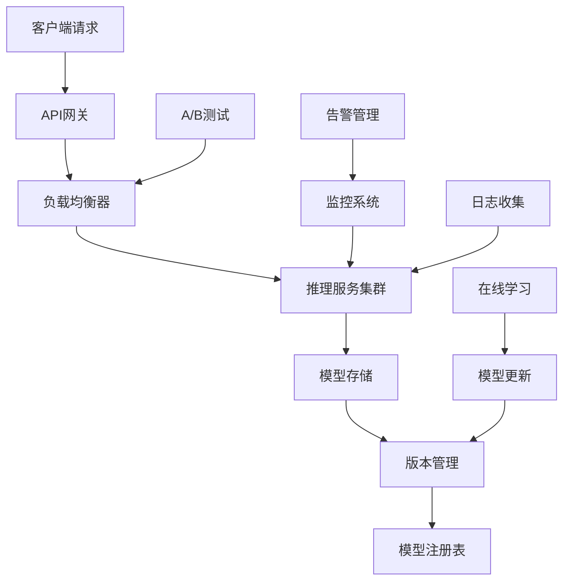

# Story 9.6: 模型服务和部署平台

**Story ID**: STORY-9.6-MODEL-SERVICE-DEPLOY  
**Epic**: Epic 9 - 模型微调和优化平台  
**优先级**: P1  
**预估工期**: 2-3周  
**故事点数**: 21  
**负责团队**: AI团队 + DevOps团队

## 📋 用户故事

作为AI系统开发者，我希望拥有一套完整的模型服务和部署平台，能够高效管理模型版本、提供稳定的推理服务、支持在线学习更新，并优化边缘设备部署，确保模型在生产环境中的高可用性和高性能。

### 🎯 用户价值

- **生产就绪**: 企业级模型服务能力，支持高并发、高可用部署
- **版本管理**: 完整的模型生命周期管理，支持灰度发布和快速回滚
- **性能优化**: 推理加速和资源优化，降低50%+服务成本
- **智能更新**: 在线学习机制，模型持续优化和自适应能力

## ✅ 验收标准

### 功能要求
- [ ] **模型版本管理**: 完整的模型注册、版本控制、元数据管理
- [ ] **推理服务**: 高性能REST/gRPC API，支持同步/异步推理
- [ ] **模型部署**: 支持Docker、Kubernetes、边缘设备多种部署方式
- [ ] **负载均衡**: 智能路由、故障转移、自动扩缩容
- [ ] **在线学习**: 增量学习、模型热更新、A/B测试框架
- [ ] **监控告警**: 全方位性能监控、异常检测、自动告警

### 技术要求
- [ ] **并发能力**: 支持10000+QPS，平均响应时间<100ms
- [ ] **可用性**: 服务可用性>99.9%，故障自动恢复<30s
- [ ] **扩展性**: 支持水平扩展，自动化资源管理
- [ ] **兼容性**: 支持PyTorch、TensorFlow、ONNX等多种模型格式
- [ ] **安全性**: API认证授权、模型加密、访问审计

### 性能指标
- [ ] **推理延迟**: P95延迟<200ms，P99延迟<500ms
- [ ] **吞吐量**: 单实例>1000 QPS，集群>10000 QPS
- [ ] **资源利用**: CPU利用率>70%，GPU利用率>80%
- [ ] **模型加载**: 模型冷启动<10s，热切换<2s

## 🏗️ 实现方案

### 系统架构



### 核心组件设计

#### 1. 模型服务引擎
- **多框架支持**: 统一接口适配PyTorch、TensorFlow、ONNX
- **推理优化**: TensorRT、OpenVINO等加速引擎集成
- **批处理**: 动态批处理和请求合并优化
- **缓存机制**: 结果缓存和模型预热策略

#### 2. 版本管理系统
- **模型注册**: 自动化模型注册和元数据管理
- **版本控制**: 语义化版本管理和变更追踪
- **存储优化**: 增量存储和压缩传输
- **灰度发布**: 渐进式部署和自动回滚

#### 3. 部署编排平台
- **容器化**: Docker镜像自动构建和管理
- **Kubernetes集成**: 原生K8s部署和资源调度
- **边缘部署**: 轻量化模型和边缘设备适配
- **自动扩缩容**: 基于负载的动态伸缩策略

#### 4. 在线学习框架
- **增量学习**: 在线数据流的增量模型更新
- **A/B测试**: 多版本模型并行测试框架
- **反馈循环**: 用户反馈收集和模型改进
- **持续部署**: 自动化模型训练和部署流程

### 数据模型

#### 模型注册表 (model_registry)
```sql
CREATE TABLE model_registry (
    id UUID PRIMARY KEY,
    name VARCHAR(255) NOT NULL,
    version VARCHAR(50) NOT NULL,
    framework VARCHAR(50) NOT NULL,
    model_path TEXT NOT NULL,
    model_size BIGINT,
    accuracy_metrics JSONB,
    deployment_config JSONB,
    created_at TIMESTAMP WITH TIME ZONE,
    created_by UUID,
    UNIQUE(name, version)
);
```

#### 部署实例表 (deployments)
```sql
CREATE TABLE deployments (
    id UUID PRIMARY KEY,
    model_id UUID REFERENCES model_registry(id),
    deployment_name VARCHAR(255) NOT NULL,
    environment VARCHAR(50) NOT NULL,
    replica_count INTEGER DEFAULT 1,
    resource_config JSONB,
    status VARCHAR(50),
    endpoint_url TEXT,
    created_at TIMESTAMP WITH TIME ZONE
);
```

### API接口设计

#### 推理服务API
```python
# REST API示例
@app.post("/v1/models/{model_name}/predict")
async def predict(
    model_name: str,
    version: Optional[str] = "latest",
    request: PredictionRequest = Body(...)
):
    """模型推理接口"""
    model = await model_manager.get_model(model_name, version)
    result = await model.predict(request.data)
    return PredictionResponse(
        prediction=result,
        model_version=model.version,
        latency_ms=result.latency
    )

# gRPC服务定义
service ModelService {
    rpc Predict(PredictRequest) returns (PredictResponse);
    rpc PredictStream(stream PredictRequest) returns (stream PredictResponse);
    rpc GetModelInfo(ModelInfoRequest) returns (ModelInfoResponse);
}
```

#### 模型管理API
```python
@app.post("/v1/models/register")
async def register_model(request: ModelRegistrationRequest):
    """注册新模型版本"""
    model_id = await model_registry.register(
        name=request.name,
        version=request.version,
        model_path=request.model_path,
        metadata=request.metadata
    )
    return {"model_id": model_id, "status": "registered"}

@app.post("/v1/deployments")
async def create_deployment(request: DeploymentRequest):
    """创建模型部署"""
    deployment = await deployment_manager.create(
        model_id=request.model_id,
        environment=request.environment,
        config=request.config
    )
    return deployment.to_dict()
```

### 推理优化策略

#### 模型加速
```python
class ModelOptimizer:
    """模型推理优化器"""
    
    def optimize_model(self, model_path: str, target_device: str):
        """模型优化和加速"""
        if target_device == "gpu":
            return self._tensorrt_optimize(model_path)
        elif target_device == "cpu":
            return self._openvino_optimize(model_path)
        return model_path
    
    def _tensorrt_optimize(self, model_path: str):
        """TensorRT优化"""
        import tensorrt as trt
        # TensorRT优化逻辑
        pass
    
    def _openvino_optimize(self, model_path: str):
        """OpenVINO优化"""
        # OpenVINO优化逻辑
        pass
```

#### 批处理优化
```python
class BatchProcessor:
    """动态批处理器"""
    
    def __init__(self, max_batch_size: int = 32, timeout_ms: int = 10):
        self.max_batch_size = max_batch_size
        self.timeout_ms = timeout_ms
        self.pending_requests = []
    
    async def process_request(self, request: PredictionRequest):
        """处理推理请求"""
        self.pending_requests.append(request)
        
        if len(self.pending_requests) >= self.max_batch_size:
            return await self._process_batch()
        
        # 等待更多请求或超时
        await asyncio.sleep(self.timeout_ms / 1000)
        return await self._process_batch()
```

### 在线学习实现

#### 增量学习框架
```python
class OnlineLearner:
    """在线学习管理器"""
    
    def __init__(self, model_path: str, learning_rate: float = 0.001):
        self.model = self._load_model(model_path)
        self.optimizer = torch.optim.Adam(self.model.parameters(), lr=learning_rate)
        self.feedback_buffer = []
    
    async def collect_feedback(self, prediction_id: str, feedback: dict):
        """收集用户反馈"""
        self.feedback_buffer.append({
            'prediction_id': prediction_id,
            'feedback': feedback,
            'timestamp': time.time()
        })
        
        if len(self.feedback_buffer) >= self.batch_size:
            await self._update_model()
    
    async def _update_model(self):
        """增量更新模型"""
        # 处理反馈数据
        batch_data = self._prepare_training_batch()
        
        # 模型更新
        loss = self._train_step(batch_data)
        
        # 评估并决定是否部署
        if self._should_deploy(loss):
            await self._deploy_updated_model()
```

### 监控和告警

#### 性能监控
```python
class ModelMonitor:
    """模型服务监控"""
    
    def __init__(self):
        self.metrics = {
            'request_count': Counter(),
            'latency': Histogram(),
            'error_rate': Counter(),
            'resource_usage': Gauge()
        }
    
    def record_request(self, latency_ms: float, success: bool):
        """记录请求指标"""
        self.metrics['request_count'].inc()
        self.metrics['latency'].observe(latency_ms)
        
        if not success:
            self.metrics['error_rate'].inc()
    
    def check_alerts(self):
        """检查告警条件"""
        error_rate = self._calculate_error_rate()
        avg_latency = self._calculate_avg_latency()
        
        if error_rate > 0.05:  # 错误率超过5%
            self._send_alert("HIGH_ERROR_RATE", error_rate)
        
        if avg_latency > 200:  # 平均延迟超过200ms
            self._send_alert("HIGH_LATENCY", avg_latency)
```

## 📋 Tasks / Subtasks

- [ ] **Task 1**: 构建模型服务引擎 (AC: 1, 2)
  - [ ] 实现多框架模型加载器
  - [ ] 开发推理服务API
  - [ ] 集成推理优化引擎
  - [ ] 实现批处理优化

- [ ] **Task 2**: 开发版本管理系统 (AC: 1)
  - [ ] 实现模型注册表
  - [ ] 开发版本控制机制
  - [ ] 添加元数据管理
  - [ ] 集成存储优化

- [ ] **Task 3**: 构建部署编排平台 (AC: 3, 4)
  - [ ] 实现容器化部署
  - [ ] 集成Kubernetes编排
  - [ ] 开发负载均衡器
  - [ ] 添加自动扩缩容

- [ ] **Task 4**: 实现在线学习框架 (AC: 5)
  - [ ] 开发增量学习机制
  - [ ] 实现A/B测试框架
  - [ ] 添加反馈收集系统
  - [ ] 集成持续部署

- [ ] **Task 5**: 集成监控告警系统 (AC: 6)
  - [ ] 实现性能监控
  - [ ] 开发异常检测
  - [ ] 添加告警管理
  - [ ] 集成日志收集

- [ ] **Task 6**: 性能优化和测试 (AC: 所有性能指标)
  - [ ] 优化推理性能
  - [ ] 实现资源管理
  - [ ] 添加安全机制
  - [ ] 进行压力测试

## 🧪 测试策略

### 单元测试
- 模型加载和推理功能测试
- API接口功能测试
- 版本管理逻辑测试
- 监控告警机制测试

### 集成测试
- 端到端推理流程测试
- 多模型并发服务测试
- 灰度发布流程测试
- 在线学习集成测试

### 性能测试
- 高并发推理性能测试
- 资源利用率测试
- 扩缩容性能测试
- 不同硬件环境测试

### 稳定性测试
- 长时间运行稳定性测试
- 故障恢复测试
- 内存泄漏测试
- 边界条件测试

## 📦 部署配置

### Docker配置
```dockerfile
FROM python:3.9-slim

WORKDIR /app
COPY requirements.txt .
RUN pip install -r requirements.txt

COPY . .

EXPOSE 8080
CMD ["uvicorn", "main:app", "--host", "0.0.0.0", "--port", "8080"]
```

### Kubernetes配置
```yaml
apiVersion: apps/v1
kind: Deployment
metadata:
  name: model-service
spec:
  replicas: 3
  template:
    spec:
      containers:
      - name: model-service
        image: model-service:latest
        resources:
          requests:
            nvidia.com/gpu: 1
            memory: "4Gi"
            cpu: "2000m"
          limits:
            nvidia.com/gpu: 1
            memory: "8Gi"
            cpu: "4000m"
        env:
        - name: MODEL_CACHE_SIZE
          value: "1000"
---
apiVersion: v1
kind: Service
metadata:
  name: model-service
spec:
  selector:
    app: model-service
  ports:
  - port: 80
    targetPort: 8080
  type: LoadBalancer
```

## 📊 监控和告警

### 关键指标
- 推理请求QPS和延迟分布
- 模型加载和切换时间
- 资源使用率和成本
- 错误率和可用性
- 用户满意度和反馈质量

### 告警规则
- 推理延迟P95超过200ms
- 错误率超过5%
- GPU利用率低于50%
- 模型加载失败
- 系统可用性低于99.9%

---

**Status**: Draft  
**Created**: 2025-08-30  
**Last Updated**: 2025-08-30  
**Dependencies**: Epic 9.1, 9.2, 9.3, 9.4, 9.5  
**Technical Lead**: AI团队  
**Stakeholders**: DevOps团队, 产品团队, 运维团队