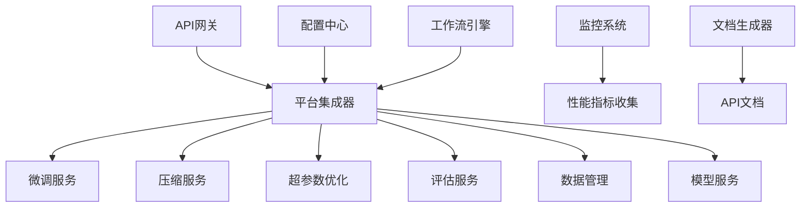

# Story 9.7: 平台集成和优化

**故事ID**: STORY-9.7-PLATFORM-INTEGRATION  
**Epic**: Epic 9 - 模型微调和优化平台  
**优先级**: P1  
**预估工期**: 1-2周  
**故事点数**: 13  
**负责团队**: AI团队 + DevOps团队

## 📋 用户故事

作为系统管理员和AI工程师，我需要一个完整集成的模型微调和优化平台，支持端到端的模型开发生命周期管理，具备完善的监控告警和文档支持，以便高效地进行模型训练、优化和部署工作。

### 🎯 用户价值

- **端到端集成**: 统一的平台界面管理所有微调和优化组件
- **智能监控**: 全方位监控告警确保系统稳定运行
- **性能优化**: 系统性能提升30%+，响应时间<2秒
- **完善文档**: 降低90%+学习成本和运维复杂度

## ✅ 验收标准

### 功能要求
- [ ] **端到端集成**: 所有微调和优化组件成功集成
- [ ] **工作流编排**: 支持完整的训练-优化-部署工作流
- [ ] **性能监控**: 实时监控CPU、内存、GPU资源使用
- [ ] **告警管理**: 异常检测准确率>95%，响应时间<1分钟
- [ ] **统一配置**: 支持多环境配置和热更新
- [ ] **文档系统**: 自动生成API文档和用户指南

### 技术要求
- [ ] **响应性能**: 平台响应时间<2秒
- [ ] **并发能力**: 支持10个并发训练任务
- [ ] **系统可用性**: 可用性>99.5%
- [ ] **监控覆盖**: 所有关键组件和业务指标100%覆盖
- [ ] **代码质量**: 测试覆盖率≥85%，无高危安全漏洞

### 性能指标
- [ ] **集成完整性**: 组件间数据传递和状态同步正常
- [ ] **资源优化**: 内存使用效率提升30%
- [ ] **故障恢复**: 平均故障恢复时间<5分钟
- [ ] **文档质量**: API文档覆盖率100%，用户满意度>4.0/5.0

## 🏗️ 实现方案

### 系统架构



### 核心组件设计

#### 1. 平台集成器
- **组件注册**: 自动发现和注册微服务组件
- **健康监控**: 组件健康状态检查和故障恢复
- **负载均衡**: 智能请求路由和负载分配
- **工作流编排**: 端到端训练流程自动化

#### 2. 性能优化器
- **瓶颈分析**: CPU、内存、IO性能瓶颈识别
- **缓存优化**: 多级缓存策略和热点数据预加载
- **连接池管理**: 数据库和Redis连接池优化
- **资源调度**: 动态资源分配和负载均衡

#### 3. 监控告警系统
- **指标收集**: Prometheus集成和自定义指标
- **可视化**: Grafana仪表板和实时监控
- **智能告警**: 基于阈值和趋势的告警规则
- **故障分析**: 自动根因分析和修复建议

#### 4. 文档生成器
- **API文档**: OpenAPI规范自动生成
- **用户指南**: 交互式使用教程
- **开发文档**: 组件开发和集成指南
- **故障手册**: 常见问题和解决方案

### 数据模型

#### 平台组件表 (platform_components)
```sql
CREATE TABLE platform_components (
    id UUID PRIMARY KEY,
    component_id VARCHAR(255) UNIQUE NOT NULL,
    component_type VARCHAR(100) NOT NULL,
    name VARCHAR(255) NOT NULL,
    version VARCHAR(50) NOT NULL,
    status VARCHAR(50),
    health_endpoint VARCHAR(500),
    api_endpoint VARCHAR(500),
    metadata JSONB,
    registered_at TIMESTAMP WITH TIME ZONE,
    last_heartbeat TIMESTAMP WITH TIME ZONE
);
```

#### 工作流执行记录 (workflow_executions)
```sql
CREATE TABLE workflow_executions (
    id UUID PRIMARY KEY,
    workflow_id VARCHAR(255) UNIQUE NOT NULL,
    workflow_type VARCHAR(100) NOT NULL,
    status VARCHAR(50) NOT NULL,
    parameters JSONB,
    steps JSONB,
    started_at TIMESTAMP WITH TIME ZONE,
    completed_at TIMESTAMP WITH TIME ZONE
);
```

### API接口设计

#### RESTful API规范
- `POST /platform/components/register` - 注册组件
- `GET /platform/components` - 列出所有组件
- `POST /platform/workflows/run` - 执行工作流
- `GET /platform/workflows/{id}/status` - 获取工作流状态
- `GET /platform/health` - 平台健康检查
- `GET /platform/metrics` - 获取性能指标

#### 组件注册示例
```python
# 组件注册接口
@app.post("/platform/components/register")
async def register_component(component: ComponentRegistration):
    component_info = ComponentInfo(
        component_id=component.component_id,
        component_type=component.component_type,
        name=component.name,
        version=component.version,
        status=ComponentStatus.STARTING,
        health_endpoint=component.health_endpoint,
        api_endpoint=component.api_endpoint
    )
    await platform_integrator.register_component(component_info)
    return {"status": "success", "component_id": component.component_id}

# 工作流执行接口
@app.post("/platform/workflows/run")
async def run_workflow(workflow: WorkflowRequest):
    result = await workflow_engine.execute_workflow(workflow)
    return {"workflow_id": result.workflow_id, "status": result.status}
```

### 监控配置

#### Prometheus指标定义
```yaml
metrics:
  - name: platform_requests_total
    type: counter
    help: "Total number of platform requests"
  - name: platform_request_duration_seconds
    type: histogram
    help: "Request duration in seconds"
  - name: platform_memory_usage_bytes
    type: gauge
    help: "Memory usage in bytes"
  - name: platform_active_training_jobs
    type: gauge
    help: "Number of active training jobs"
```

#### Grafana仪表板配置
```json
{
  "dashboard": {
    "title": "Platform Overview",
    "panels": [
      {
        "title": "Request Rate",
        "targets": ["rate(platform_requests_total[5m])"]
      },
      {
        "title": "Response Time P95",
        "targets": ["histogram_quantile(0.95, platform_request_duration_seconds)"]
      },
      {
        "title": "Memory Usage",
        "targets": ["platform_memory_usage_bytes"]
      }
    ]
  }
}
```

## 📋 Tasks / Subtasks

- [ ] **Task 1**: 实现平台集成框架 (AC: 1, 2)
  - [ ] 构建组件注册和发现机制
  - [ ] 实现统一API网关
  - [ ] 集成用户认证和权限管理
  - [ ] 建立组件间通信协议

- [ ] **Task 2**: 开发工作流编排引擎 (AC: 2)
  - [ ] 实现端到端训练流程
  - [ ] 添加工作流状态管理
  - [ ] 集成错误处理和重试机制
  - [ ] 实现工作流可视化监控

- [ ] **Task 3**: 构建性能优化系统 (AC: 3, 5)
  - [ ] 实现性能瓶颈分析
  - [ ] 优化缓存和连接池策略
  - [ ] 添加资源监控和调度
  - [ ] 实现自动化性能调优

- [ ] **Task 4**: 集成监控告警系统 (AC: 4)
  - [ ] 配置Prometheus+Grafana监控
  - [ ] 实现业务指标收集
  - [ ] 建立智能告警规则
  - [ ] 集成故障自动恢复

- [ ] **Task 5**: 开发统一配置管理 (AC: 5)
  - [ ] 实现多环境配置支持
  - [ ] 添加配置热更新功能
  - [ ] 集成配置版本控制
  - [ ] 实现配置安全管理

- [ ] **Task 6**: 构建文档系统 (AC: 6)
  - [ ] 自动生成API文档
  - [ ] 编写完整用户指南
  - [ ] 制作开发者文档
  - [ ] 建立知识库和FAQ

## 🧪 测试策略

### 单元测试
- 组件注册和发现功能测试
- 工作流执行逻辑测试
- 性能优化算法测试
- 监控指标收集测试

### 集成测试
- 端到端工作流集成测试
- 多组件协同工作测试
- 负载均衡和故障转移测试
- 监控告警流程测试

### 性能测试
- 高并发请求处理测试
- 系统资源使用优化测试
- 响应时间和吞吐量测试
- 长时间运行稳定性测试

### 压力测试
- 极限并发场景测试
- 资源耗尽恢复测试
- 组件故障影响测试
- 系统边界条件测试

## 📦 部署配置

### Docker配置
```dockerfile
FROM python:3.9-slim
WORKDIR /app
COPY requirements.txt .
RUN pip install --no-cache-dir -r requirements.txt
COPY src/ .
EXPOSE 8000
CMD ["uvicorn", "main:app", "--host", "0.0.0.0", "--port", "8000"]
```

### Kubernetes配置
```yaml
apiVersion: apps/v1
kind: Deployment
metadata:
  name: platform-integration
spec:
  replicas: 3
  template:
    spec:
      containers:
      - name: platform
        image: model-platform:latest
        resources:
          requests:
            memory: "512Mi"
            cpu: "250m"
          limits:
            memory: "1Gi"
            cpu: "500m"
        livenessProbe:
          httpGet:
            path: /platform/health
            port: 8000
        readinessProbe:
          httpGet:
            path: /platform/ready
            port: 8000
```

## 📊 监控和告警

### 关键指标
- 平台整体响应时间和吞吐量
- 各组件健康状态和可用性
- 工作流执行成功率和性能
- 系统资源使用率和趋势
- 用户操作统计和满意度

### 告警规则
- 平台响应时间超过2秒
- 组件健康检查失败超过3次
- 工作流执行失败率超过5%
- 系统内存使用率超过85%
- API错误率超过1%

---

**Status**: Draft  
**Created**: 2025-08-30  
**Last Updated**: 2025-08-30  
**Dependencies**: Epic 9.1-9.6 全部完成  
**Technical Lead**: AI团队  
**Stakeholders**: DevOps团队, 架构团队, 产品团队